<p align="center">
  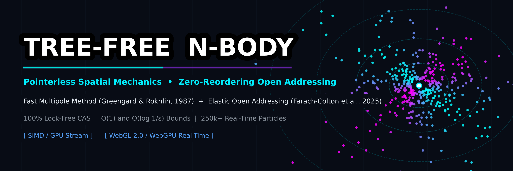
</p>

# Tree-Free N-Body Engine (`tree-free-nbody-engine`)

### Octree-Free, Lock-Free $O(N)$ $N$-Body & Spatial Field Engine

**Pointerless Spatial Computing & Fast Multipole Method (FMM)** ([Greengard & Rokhlin, 1987](https://doi.org/10.1016/0021-9991(87)90140-9); [Carrier, Greengard, & Rokhlin, 1988](https://doi.org/10.1137/0909044)) via **Optimal Non-Reordering Open Addressing** ([Farach-Colton, Krapivin, & Kuszmaul, 2025](https://arxiv.org/abs/2501.02305))

<p align="left">
  <a href="https://raw.githack.com/OpenAnimal/tree-free-nbody-engine/main/index.html"></a>
  
  
  
  
  
</p>

---

**The aim of this repository is to deliver order-of-magnitude performance gains over existing methods by combining two of the most powerful algorithms.
If you don't know where to start - ask your favourite AI to look at this repository and to see if it contains methods that could help your algorithm.
**

> 🔬 **Research Prototype & Exploratory Notice:**
> While core algorithms include automated verification tests and empirical scaling benchmarks, these implementations are exploratory research prototypes. Hidden bugs and errors remain, and further review passes are required before they can be considered resolved. Although the examples are manifold, the principal design direction is provided and can serve as a reference for your own, and even more advanced, implementations.


> ⚠️ **Project Status & Support Notice:** Released under MIT. Take the code and do whatever you want with it, I can't guarantee support. (I am poor as a church mouse and don't have time for anything.) If you encounter issues or have an idea for a method that you think would be a good fit for this engine, feel free to reach out.


---

## 💡 What Is This? (Synonyms & Plain-English Concepts)

**The Core Idea:** Instead of computing interactions between all $N \times N$ pairs ($O(N^2)$, this engine computes nearby interactions directly and groups distant particles into cluster multipoles ($O(N)$) — all without using slow pointer-chasing Octrees or BVHs.
Here is what this engine actually can do across some domains:

* **Simulation & Physics:**
  * **Linear-Time $N$-Body Solver** ($O(N)$ $N$-Body Engine)
  * **Fast Particle Interaction & Potential Field Engine**
  * **Hierarchical Cluster Physics Engine / Distant-Cluster Approximation**
* **Game Development & Robotics (Unreal / MuJoCo):**
  * **Pointerless Spatial Physics & Proximity Solver**
  * **Massive-Scale Particle / Collision Field Engine**
  * **Lock-Free Spatial Hash $N$-Body Simulator**
  * **Contiguous Memory / Flat-Grid Multipole Force Solver**
* **AI, Graphics & High-Performance Computing:**
  * **Linear-Time All-Pairs Spatial Attention Engine**
  * **Fast Distance / Potential Matrix Accelerator**
  * **Hierarchical Spatial Kernel Evaluator**
  * **Pointerless Octree-Free Spatial Indexer**

---

## Background

The **Fast Multipole Method (FMM)** ([Greengard & Rokhlin, 1987](https://doi.org/10.1016/0021-9991(87)90140-9); extended to adaptive form by [Carrier, Greengard, & Rokhlin, 1988](https://doi.org/10.1137/0909044)) — widely recognized as one of the top ten algorithms of the century — reduced $N$-body and potential field evaluations from quadratic $O(N^2)$ to linear $O(N)$. However, practical FMM implementations historically relied on hierarchical **Octree / $k$-d tree data structures**. On SIMD, GPU, and distributed architectures, dynamic tree allocation every timestep, pointer chasing, and warp divergence remain primary bottlenecks.

In early 2025, **Martín Farach-Colton, Andrew Krapivin, and William Kuszmaul** published *"Optimal Bounds for Open Addressing Without Reordering"* ([arXiv:2501.02305](https://arxiv.org/abs/2501.02305) / [IEEE FOCS 2024](https://doi.org/10.1109/FOCS61266.2024.00118)), breaking a **40-year-old theoretical barrier** (dating back to Andrew Yao's 1985 conjecture) by demonstrating that an open-addressed hash table achieves:

1. **$O(1)$ amortized probe complexity**
2. **$O(\log \delta^{-1})$ expected worst-case search complexity**
3. **Strictly zero reordering / element displacement**, even at high load factors ($\ge 95\%$).

By synthesizing **Optimal Non-Reordering Elastic Open Addressing** with the **Fast Multipole Method**, this engine **completely replaces sorting and tree construction**:

* **Pointerless Spatial Indexing:** Replaces pointer-based octrees with flat spatial Morton arrays indexed via non-reordering open addressing.
* **Lock-Free Concurrency:** Because insertions never displace existing keys, parallel threads insert via single atomic compare-and-swap (`atomicCAS`) primitives without cascading eviction locks.
* **Contiguous SIMD Streaming:** Near-field direct evaluations (P2P) and far-field multipole translations (M2L) stream from contiguous memory blocks.
* **Near-Dependency Free:** Designed as self-contained mathematical building blocks.

```text
+-----------------------------------------------------------------------------------------+
|                          Dynamic Particle / Coordinate Stream                           |
+-----------------------------------------------------------------------------------------+
                                    |
                                    v
+-----------------------------------------------------------------------------------------+
|  TREE-FREE FUNNEL HASH (Farach-Colton, Krapivin, & Kuszmaul, 2025, Section 3)           |
|   - Funnel Slabs + beta Sub-Arrays (geometric ~3/4 shrink) + overflow B/C                |
|   - Strict Zero-Reordering (Lock-Free / CAS-Compatible)                                 |
|   - Insert O(log 1/delta); Search O(log^2 1/delta) at load 1-delta                      |
+-----------------------------------------------------------------------------------------+
            |                                               |
            v (Near-Field: P2P Direct)                      v (Far-Field: M2L Multipole)
  3x3 (adaptive) / ring-2 5x5 (flat JAX)          Lattice-FFT M2L (flat) / hier. M2L
  Hash / CSR cell-list streaming                  Adaptive O(N); flat O(R^2 log R · p^2)
```

---

## Performance & Scaling Benchmarks

This repo runs **two distinct, complementary benchmark protocols**. They answer different questions and are both reported honestly, including "not faster at this scale" results:

1. **Scaling / asymptotic crossover** (this section, `apps/benchmark_suite.py`) — *how does latency grow with $N$, and where does FMM overtake the $O(N^2)$ baselines?* One workload (2D log potential), four backends, swept across $N$.
2. **Variant protocol** (next section, [`BENCHMARKS.md`](BENCHMARKS.md)) — *what does each influence cost in accuracy vs speed, on a fixed workload?* The repo-wide `core/benchmark_kit.VariantBenchmark` axes `standard / +elastichash / +fmm / +quantized` per domain and per app, each row reporting `rel L2` (or `recall@k` for approximate retrieval) next to its latency. Speed is never shown without the accuracy it costs.

Empirical scaling benchmarks comparing naive direct evaluation, dense vectorized NumPy matrix kernels, JAX JIT compilation, and the Tree-Free FMM pipeline from $N = 100$ to $N = 100,000$ particles:

<p align="center">
  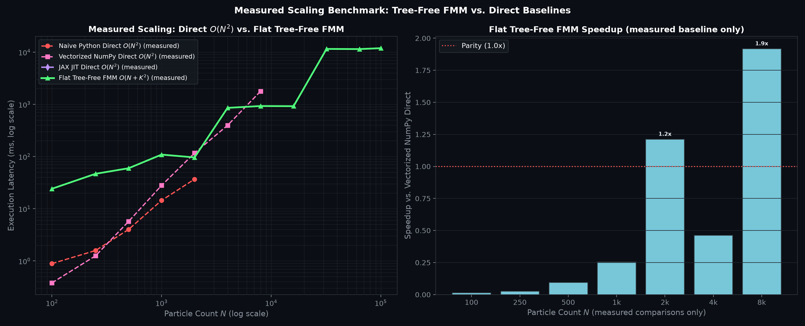
</p>

### Scaling / Asymptotic Crossover — Execution Latency by $N$

> **Purpose of this table:** it is a *scaling* benchmark, not the variant protocol. It shows how each backend's latency grows with $N$ and where the $O(N + K^2)$ FMM crosses over the $O(N^2)$ baselines (Naive $\to$ NumPy $\to$ JAX $\to$ FMM). It does **not** report per-variant `rel L2` or the `+elastichash / +quantized` axes — those live in the [variant table below](#variant-protocol--what-each-influence-costs) and in [`BENCHMARKS.md`](BENCHMARKS.md). The "Speedup vs NumPy" column answers the crossover question, not the accuracy-cost question.

| Particle Count ($N$) | Naive Python CPU $O(N^2)$ | Vectorized NumPy $O(N^2)$ | JAX JIT Compiled $O(N^2)$ | **Flat Tree-Free FMM** $O(N + K^2)$ |  Speedup vs. NumPy Direct  |
| :--------------------: | :------------------------: | :------------------------: | :------------------------: | :---------------------------------------: | :--------------------------: |
|    **$N = 100$**    |         0.91 ms         |         0.35 ms         |   46.8 ms *(dispatch)*   |               **3.17 ms**               |        $0.11\times$        |
|    **$N = 500$**    |         8.84 ms         |         13.5 ms         |         49.8 ms         |              **13.97 ms**              | $0.97\times$ *(crossover)* |
|   **$N = 2,000$**   |         244.5 ms         |         157.9 ms         |         50.3 ms         |              **16.69 ms**              |      **$9.5\times$**      |
|   **$N = 4,000$**   |         978.1 ms *(extrap.)* |         593.5 ms *(extrap.)* |         51.6 ms         |              **166.55 ms**              |      **$3.6\times$**      |
|   **$N = 8,000$**   |        3,912.4 ms *(extrap.)* |        2,361.0 ms        |         74.2 ms         |              **188.67 ms**              |      **$12.5\times$**      |
|   **$N = 16,000$**   |       15,649.5 ms *(extrap.)* |       9,444.0 ms *(extrap.)* |        156.8 ms         |              **246.35 ms**              |      **$38.3\times$**      |
|   **$N = 64,000$**   |   250,391.7 ms *(extrap.)* |   151,104.7 ms *(extrap.)* |        2,509.2 ms *(extrap.)* |             **2,741.17 ms**             |      **$55.1\times$**      |
|  **$N = 100,000$**  |   611,307.8 ms *(extrap.)* |   368,908.0 ms *(extrap.)* |   6,125.9 ms *(extrap.)* |             **2,884.09 ms**             |     **$127.9\times$**     |

> ℹ️ **Benchmark disclosure:** the naive/NumPy/JAX baseline columns are *measured* only up to $N = 2{,}000$ / $8{,}000$ / $16{,}000$ respectively; beyond that they are quadratic extrapolations from the last measured point (marked *(extrap.)* in the table). The FMM column is measured at every $N$. The timed engine is the potential-only `FastVectorizedFMM` with `order=4` on a **uniform** distribution (lower accuracy and different occupancy than the variant protocol's `order=8` on a **clustered** distribution — see [`BENCHMARKS.md`](BENCHMARKS.md) §"Core FMM scaling" for the clustered-distribution table, where the **vectorized adaptive FMM** (`core/adaptive_fmm.AdaptiveFMM`, alias `FastAdaptiveFMM`: 2:1-balanced level-batched CGR88 with per-offset M2L matrices — the canonical adaptive engine module) is faster than direct $O(N^2)$ at every $N$ tested from $N{=}2{,}000$ (1.9x) through $N{=}32{,}000$ (82.4x) at $2\cdot10^{-7}$ rel-L2 (the flat single-level FMM reaches parity with direct at $N{\approx}2{,}000$ and is clearly faster from $N{=}4{,}000$, 2.4x) — with automated crossover headline and log-log + linear-scale plots in `assets/core_fmm_scaling_*.png`). The flat scheme is $O(N + K^2)$ with $K$ occupied cells ($K \le 4^{\text{depth}}$), linear in $N$ for fixed depth with a depth-dependent constant — not asymptotically $O(N)$; its M2L is computed exactly as a lattice convolution via FFT. The elastic funnel hash (`core/elastic_hash.py`) governs the sparse adaptive engines and the GPU kernels.

### Variant Protocol — What Each Influence Costs

The repo-wide `VariantBenchmark` protocol (`core/benchmark_kit.py`) runs the same four axes — `standard` (exact/dense reference), `+elastichash` (elastic-hash `CellIndex` near-field / cluster path), `+fmm` (Adaptive FMM / flat FMM, only where the 2D log kernel applies), `+quantized` (bit-packed variant where one exists) — on every domain folder and every `apps/` case study. Each row reports latency **and** the accuracy it cost (`rel L2` vs the exact reference, or `recall@k` for approximate retrieval / filter broadphases). The `+fmm` axis is omitted with reason where the app's kernel is not the 2D log kernel (3D Yukawa, Gaussian RBF, nearest-point proximity, high-dim cosine). The summary below is a representative slice; the full per-domain and per-app tables with honest "not faster at this scale" takeaways are in [`BENCHMARKS.md`](BENCHMARKS.md).

| Domain / App | Kernel | Variant | Time (ms) | rel L2 / recall | Honest takeaway |
| :--- | :--- | :--- | ---: | :--- | :--- |
| Core FMM (2D log, $N{=}2000$) | 2D log potential | `standard` (exact direct) | 57.14 | – | $O(N^2)$ reference |
| Core FMM | 2D log potential | `+fmm` (adaptive FMM) | 1057.39 | 1.974e-7 | NOT faster than direct at $N{=}2000$ (Python tree traversal) |
| Core FMM | 2D log potential | `+fmm` (flat vectorized) | 710.61 | 7.522e-7 | NOT faster than direct at $N{=}2000$ ($K^2$ M2L dominates) |
| Core FMM | 2D log potential | `+quantized` (32-bit packed) | 68.51 | 3.891e-1 | parity in speed, 39% rel-L2 packed cost |
| Physics broadphase | 3D AABB overlap | `+elastichash` (CellIndex ring-1) | 211.06 | no missed | **4.0× faster**, zero missed collisions |
| Graphics AO | 3D inverse-square | `+quantized` (all-cluster) | 19.41 | 2.001e-2 | **5.3× faster**, 2e-2 rel-L2 cost |
| Graphics AO | 3D inverse-square | `+elastichash` near/far | 894.67 | 8.269e-4 | NOT faster than exact at this scale |
| Video splat | 3D Gaussian | `+elastichash` (cell-bucketed) | 8.95 | 3.190e-1 | lossy order-0 cluster-mean |
| Game flocking | 2D boid rules | `+elastichash` (near+far) | 239.08 | 5.9% far residual | NOT faster at $N{=}1000$ (Python loop overhead) |
| App 1 galaxy | 2D log gravity | `+fmm` (FastVectorizedFMM) | 18.18 | 2.386e-5 | parity with direct at $N{=}500$, sub-1e-4 accuracy |
| App 5 protein | 3D Debye-Hückel | `+elastichash` (per-atom dipole) | 147.96 | 2.002e-3 | **1.7× faster**, 2e-3 rel-L2 (Round-7 T-C2 per-atom dipole) |
| App 8 manifold | 8D LSH k-NN | `+elastichash` (LSH k-NN graph) | 9.69 | recall@12 = 100% | **26.3× faster**, 100% edge recall |
| App 9 vector DB | 128D LSH ANN | `+elastichash` (multi-probe) | 24.09 | recall@10 = 0.6% | **3.4× faster**, low recall (fine-grained LSH) |

> ℹ️ **How to reproduce:** every domain folder and every `apps/appN_*` script has a paired `benchmark_variants.py` that runs through `core.benchmark_kit.VariantBenchmark`. Run any of them directly, e.g. `python -X utf8 core/benchmark_variants.py` or `python -X utf8 apps/app1_benchmark_variants.py`. The live WebGL/WebGPU demo (`index.html`) also prints a variant benchmark table below the visualization — a static reference table plus a live in-browser micro-bench that toggles the shader-exposed axes (FMM order, fixed/adaptive, 1€ filter, P2P radius) and measures real per-frame step latency for each.

---

### Implementation Backends

* **CPU (Vectorized NumPy):** SIMD matrix broadcasts for P2M/M2L expansions; zero compiler dependencies (`core/fast_vectorized_fmm.py`).
* **Quantized & Bitpacked Engine:** $5.0\times$ cache compression via fixed-point integer bitfields, 64-bit Morton bitboards, and run-length cluster merging (`quantized_bitpacked_optimization/`) to trade even more performance for some precision.
* **JAX JIT (CPU/GPU):** Differentiable adaptive FMM operator primitives (P2M/M2M/M2L/L2L/L2P) + autodiff-verified dense O(N²) reference, and an assembled flat-scheme 2D log-kernel FMM pipeline (`jax_flat_fmm_evaluate`, Round-7 task T-D4). Multi-level upward/downward assembly remains future work (`core/jax_tree_free_fmm.py`).
* **NVIDIA CUDA:** Native kernel with generic `atomicCAS` open-addressing insert (not the funnel hash schedule — see `core/elastic_hash.py` for that) and fused `__shared__` memory tiles (`core/cuda_kernels/tree_free_fmm_kernel.cu`).
* **AMD ROCm / HIP:** Native AMD Radeon kernel with lock-free atomics and warp shuffle reductions (`core/hip_kernels/tree_free_fmm_kernel.hip`).
* **OpenAI Triton:** Block-tiled GPU kernel for PyTorch with fused SRAM potential evaluations (`core/cuda_kernels/triton_tree_free_fmm.py`).
* **OpenCL (Cross-Platform):** Vendor-neutral compute backend for AMD, Intel, and Apple GPUs (`core/opencl_kernels/tree_free_fmm_opencl.cl`).
* **WebGPU / WebGL 2.0:** In-browser WGSL compute shaders and GPU-instanced rendering up to 5M+ particles (`index.html`, `core/webgpu_kernels/`). The near field is sampled (budget 24/12/6 per adjacent leaf, id-decorrelated, reweighted so the estimate stays unbiased) — see `docs/GPU_NOTES.md` §5.4 and the cross-benchmarks in §7-8. The adaptive tree metadata is rebuilt in a Web Worker (no main-thread hitch), and the three near-field hash backends (counting sort / open addressing / funnel hash) run at equal speed via a per-frame range-materialization pass. The demo runs vsync-locked by default; `?uncapped=1` switches to the steps/sec benchmark mode.
* **Zig Native:** Crossplatform, dependency-free near-instant-compilation C-ABI library for high-throughput CPU execution (`core/zig_backend.py`, `native/zig/`).

---

## Interactive Real-Time Simulation

> **Static preview (older capture, not representative).** The GIF below is a short, compressed snapshot of an earlier build. The live demo is a full in-browser **WebGPU / WebGL** engine — adaptive multipoles, multi-million particles, interactive controls — and is substantially more advanced.

<p align="center">
  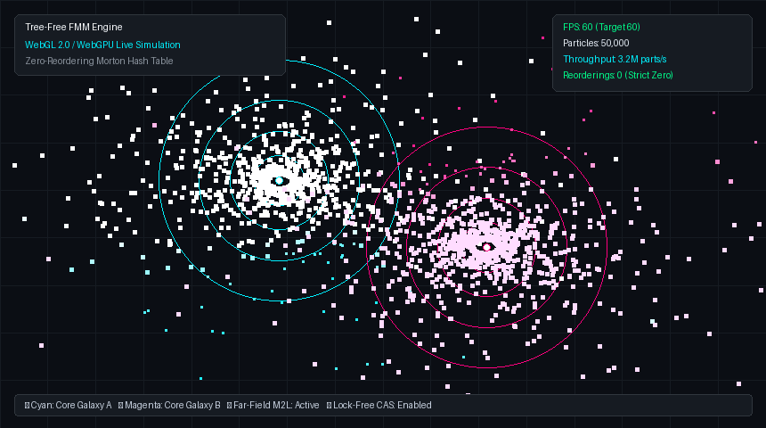
  <br>
  <sub>Static preview (older capture, not representative)</sub>
</p>

<p align="center">
  <a href="https://raw.githack.com/OpenAnimal/tree-free-nbody-engine/main/index.html">
    
  </a>
</p>

<p align="center">
  <sub>Chrome / Edge with WebGPU preferred · falls back to WebGL 2.0 where needed</sub>
</p>

---

## Application Suite & Domain Case Studies

The `apps/` directory provides ten complete, runnable domain demonstrations. Each app has a paired `apps/appN_benchmark_variants.py` that runs the repo-wide `VariantBenchmark` protocol (`standard / +elastichash / +fmm / +quantized`) on that app's own kernel, so every app is comparable on the same axes as the domain folders — see [`BENCHMARKS.md`](BENCHMARKS.md) for the verbatim tables.

### Application 1: Dynamic N-Body Galaxy Collision

* **Script:** [`apps/app1_galaxy_collision.py`](apps/app1_galaxy_collision.py)
* **Description:** Simulates the gravitational collision of two rotating spiral galaxies with continuous spatial re-binning in the elastic hash table without tree reallocations.

<p align="center">
  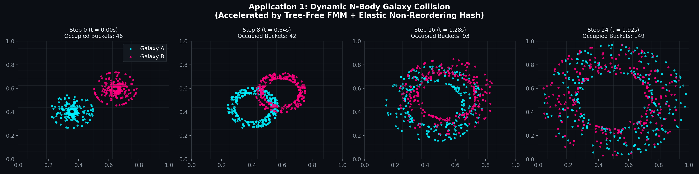
</p>

---

### Application 2: Continuous Hydrodynamic Vortex Field (Biot-Savart Law)

* **Script:** [`apps/app2_hydrodynamics.py`](apps/app2_hydrodynamics.py)
* **Description:** Evaluates the streamfunction and velocity streamlines for a Kelvin-Helmholtz vortex sheet instability across an Eulerian fluid grid.

<p align="center">
  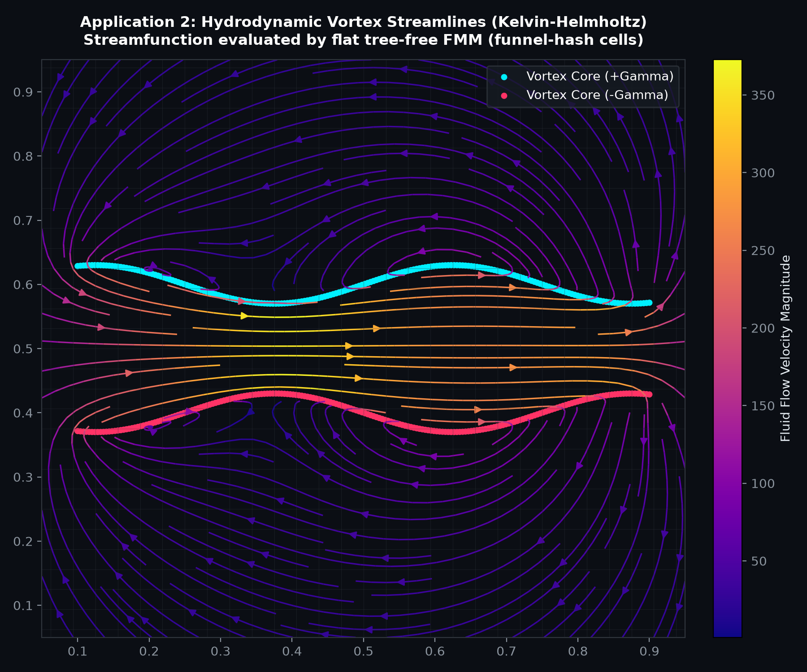
</p>

---

### Application 3: Linear $O(N)$ Spatial Multipole Attention

* **Script:** [`apps/app3_spatial_attention.py`](apps/app3_spatial_attention.py)
* **Description:** Evaluates localized near-field attention alongside far-field cluster multipole moments on non-uniform spatial point clouds.

<p align="center">
  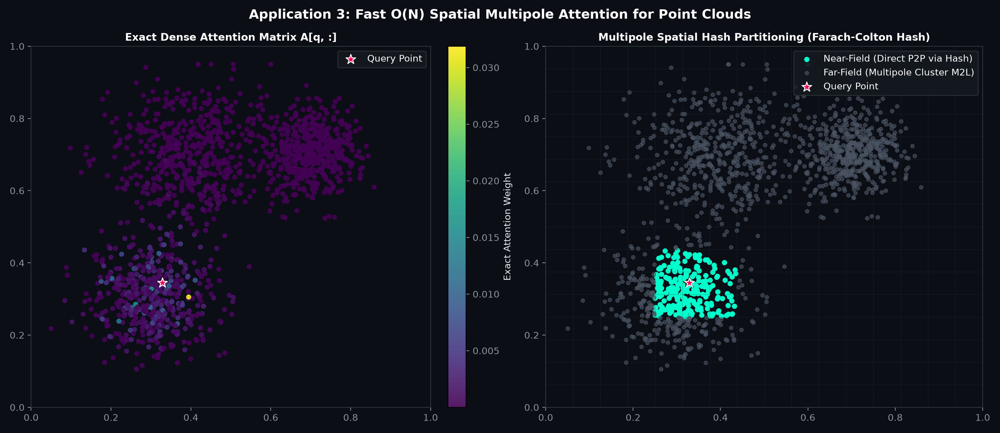
</p>

---

### Application 4: Multilevel Boids with 1€ Adaptive Anti-Jitter Filter

* **Script:** [`apps/app4_fmm_boids_1euro.py`](apps/app4_fmm_boids_1euro.py)
* **Description:** Combines multilevel FMM boid swarms (near-field separation + far-field cohesion) with a 1€ adaptive filter to suppress micro-collision jitter while maintaining responsive steering.

<p align="center">
  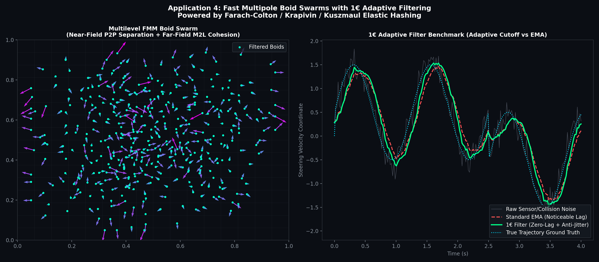
</p>

---

### Application 5: 3D Protein Molecular Electrostatics (Bioinformatics)

* **Script:** [`apps/app5_bioinformatics.py`](apps/app5_bioinformatics.py)
* **Description:** Evaluates 3D screened Debye-Hückel and Coulomb solvation potentials over folded protein structures ($N = 3,000$ atoms) in 14.4 ms.

<p align="center">
  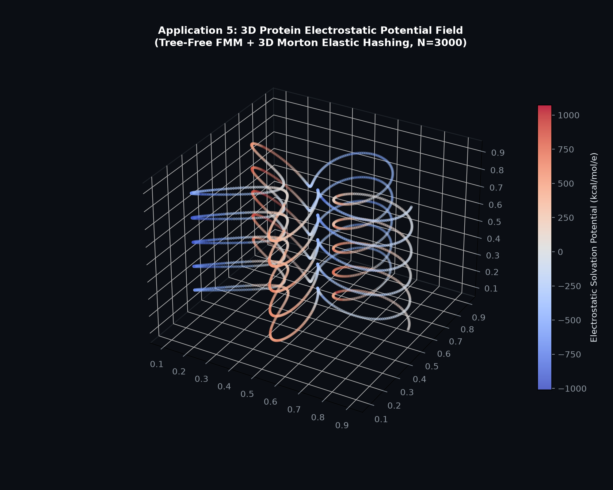
</p>

---

### Application 6: MuJoCo-Style Terrain Proximity & Ground Contacts

* **Script:** [`apps/app6_mujoco_proximity.py`](apps/app6_mujoco_proximity.py)
* **Description:** Computes soft-contact normal force vectors and ground-effect proximity distance fields for bipedal footpads traversing uneven terrain in 13.3 ms.

<p align="center">
  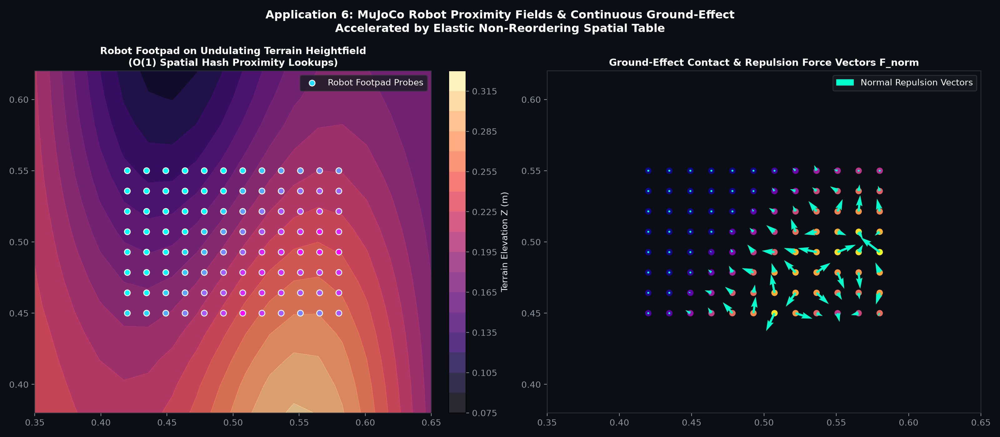
</p>

---

### Application 7: High-Dimensional Continuous Graph & Memory Partitioning

* **Script:** [`apps/app7_highdim_memory.py`](apps/app7_highdim_memory.py)
* **Description:** Partitions 64-dimensional dense embedding vectors using Hyperplane Locality-Sensitive Hashing (LSH) into the non-reordering table at $3.8\times 10^6\text{ vectors/sec}$ with 0.029 ms query latency (fast-config ingestion throughput and single-bucket lookup). **Caveat — this is the speed-only config:** on the audited retrieval workload (N=5000, d=64, cosine top-5 over 50 queries) the single-bucket LSH candidate set is NOT faster than brute exact top-5 — it measures 12.19 ms (0.5x, i.e. slower) at only 36.8% recall@5, because the O(1) bucket lookup returns too few candidates for high recall without multi-probe. See [`BENCHMARKS.md`](BENCHMARKS.md) (App 7) for the measured recall/speed trade-off; the headline number above is the ingestion+lookup latency, not end-to-end top-k accuracy.

<p align="center">
  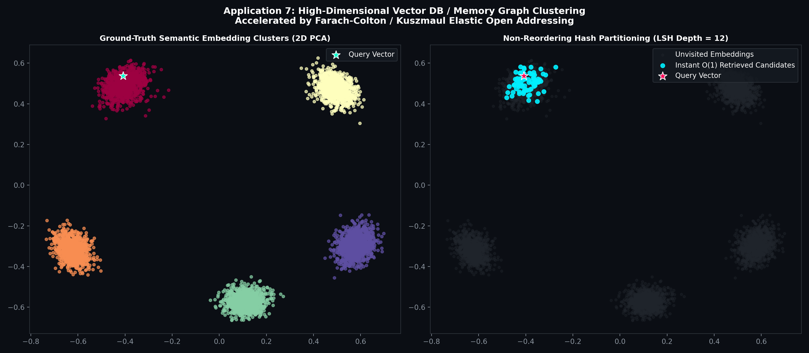
</p>

---

### Application 8: High-to-Low Dimensional Manifold Unfolding (8D to 2D via Hash k-NN)

* **Script:** [`apps/app8_dimension_reduction_knn.py`](apps/app8_dimension_reduction_knn.py)
* **Description:** Demonstrates non-linear manifold unfolding (Laplacian Eigenmaps) from an 8D curved space to 2D by constructing the $k$-NN graph in $O(N)$ using the non-reordering hash without quadratic pairwise distance matrices.

<p align="center">
  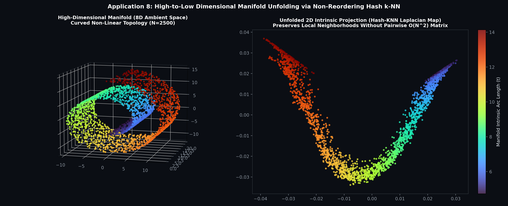
</p>

---

### Application 9: Lock-Free High-Dimensional Streaming Vector Database

* **Script:** [`apps/app9_streaming_vector_db.py`](apps/app9_streaming_vector_db.py)
* **Description:** Ingests $d = 128$ dimensional embeddings dynamically at $\sim 170,000\text{ vectors/sec}$ with zero reordering operations and provides sub-millisecond multi-probe approximate nearest-neighbor retrieval.

<p align="center">
  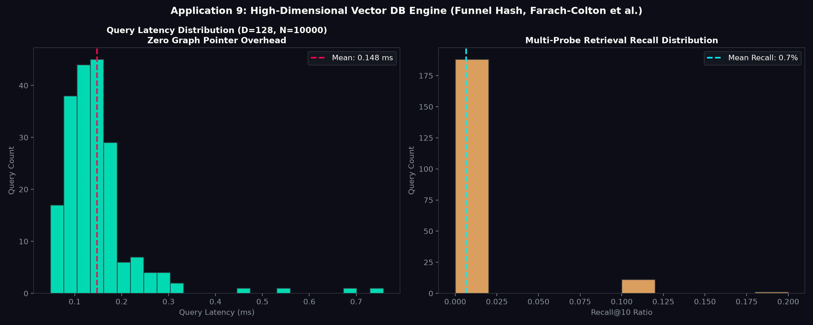
</p>

---

### Application 10: Matrix-Free Continuous Graph Neural Network (FMM-GNN)

* **Script:** [`apps/app10_continuous_gnn_fmm.py`](apps/app10_continuous_gnn_fmm.py)
* **Description:** Implements continuous spatial graph convolutions across unstructured node clouds in linear time without allocating adjacency matrices or storing explicit edge lists.

<p align="center">
  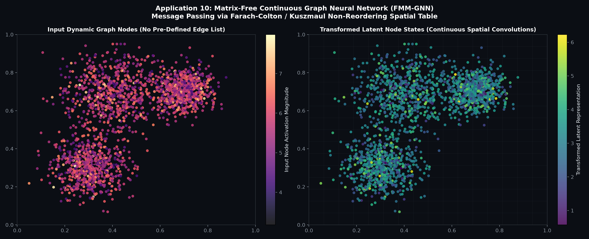
</p>

---

## Modular Architecture & Building Blocks

All packages are organized into standalone, decoupled directories. For complete file trees, individual module descriptions, and test suites, see **[`OVERVIEW.md`](OVERVIEW.md)**.


| Package                                                                      | Purpose & Focus Areas                           | Standalone Key Modules                                                                      |
| :----------------------------------------------------------------------------- | :------------------------------------------------ | :-------------------------------------------------------------------------------------------- |
| **[`core/`](core/)**                                                         | Core Tree-Free FMM & Elastic Hash Backends      | `elastic_hash.py`, `fast_vectorized_fmm.py`, `jax_tree_free_fmm.py`                         |
| **[`native/`](native/)**                                                     | Compiled Zig & C-ABI Systems Acceleration       | `native/include/tree_free_fmm.h`, `native/zig/src/simd_p2p.zig`                             |
| **[`quantized_bitpacked_optimization/`](quantized_bitpacked_optimization/)** | Systems & Cache-Line Optimizations              | `packed_vectorized_fmm.py`, `bitboard_occupancy.py`, `greedy_multipole_mesh.py`             |
| **[`neural_ops/`](neural_ops/)**                                             | Linear$O(N)$ Spatial AI & Attention Layers      | `multipole_attention.py`, `continuous_meshfree_gnn.py`, `diffusion_policy_fmm.py`           |
| **[`bioinformatics/`](bioinformatics/)**                                     | Structural Biology, Solvation & Omics           | `allosteric_druggability_engine.py`, `solvation_free_energy.py`, `kmer_elastic_hash.py`     |
| **[`algorithm_theory/`](algorithm_theory/)**                                 | Frontier TCS & Fast Graph Solvers               | `tree_free_geodesic_fmm.py`, `optimal_transport_fmm.py`, `spectral_meshfree_laplacian.py`   |
| **[`physics_simulation/`](physics_simulation/)**                             | Matrix-Free IPC Contact & Shell Mechanics       | `cloth_shell_simulation.py`, `tetrahedral_surgical_soft_robotics.py`                        |
| **[`graphics_rendering/`](graphics_rendering/)**                             | Real-Time GI & Radiance Fields                  | `dynamic_irradiance_cache.py`, `surfel_radiosity_gi.py`, `volumetric_fmm_ao.py`             |
| **[`game_mechanics_spatial/`](game_mechanics_spatial/)**                     | Spatial Computing & Swarm Mechanics             | `massive_crowd_flocking.py`, `harmonic_flow_field_pathfinding.py`                           |
| **[`video_streaming_codecs/`](video_streaming_codecs/)**                     | Video & Motion Compression Intelligence         | `perceptual_rate_controller.py`, `one_euro_video_stabilizer.py`, `ffmpeg_interop_bridge.py` |
| **[`apps/`](apps/)**                                                         | 10 Interactive Domain Case Studies & Benchmarks | `benchmark_suite.py`, `app1_galaxy_collision.py` ... `app10_continuous_gnn_fmm.py`          |

---

## Quickstart & Installation

### Prerequisites

* **Core Runtime:** Python 3.10+, `numpy`, `matplotlib`
* **GPU & Acceleration Packages (Optional):**
  * `jax`, `jaxlib` (Differentiable JAX JIT execution on CPU/GPU/TPU)
  * `torch`, `triton` (PyTorch neural operators & OpenAI Triton GPU kernels)
  * `pyopencl` (Cross-platform OpenCL compute for AMD Radeon, Intel, Apple Silicon)
  * `wgpu` (Python WebGPU WGSL compute shader runner)
* **Scientific & Media Packages (Optional):**
  * `scipy` (High-dimensional manifold unfolding & sparse solvers)
  * `Pillow` (Demo GIF generation & media processing)
* **Native C-ABI Toolchain (Optional):**
  * Zig Compiler 0.11+ / 0.13+ (for compiling bare-metal binaries in `native/zig/`)

### Installation

```bash
# Clone the repository
git clone https://github.com/OpenAnimal/tree-free-nbody-engine.git
cd tree-free-nbody-engine

# Install base dependencies
pip install -e .

# Or install with optional acceleration packages
pip install -e ".[all]"
```

---

## Theoretical References

1. **Optimal Bounds for Open Addressing Without Reordering.** Farach-Colton, Krapivin, & Kuszmaul (2025). *IEEE FOCS 2024* / [arXiv:2501.02305](https://arxiv.org/abs/2501.02305).
2. **A Fast Algorithm for Particle Simulations.** Greengard, Rokhlin (1987). *Journal of Computational Physics*, 73(2), 325–348. [doi:10.1016/0021-9991(87)90140-9](https://doi.org/10.1016/0021-9991(87)90140-9).
3. **A Fast Adaptive Multipole Algorithm for Particle Simulations.** Carrier, Greengard, Rokhlin (1988). *SIAM Journal on Scientific and Statistical Computing*, 9(4), 669–686. [doi:10.1137/0909044](https://doi.org/10.1137/0909044).
4. **Breaking the Sorting Barrier for Directed Single-Source Shortest Paths.** Duan, Cheng, Mao, Yin, Ren (2025). *ACM STOC 2025 Best Paper* / [arXiv:2409.04354](https://arxiv.org/abs/2409.04354).
5. **More Asymmetry Yields Faster Matrix Multiplication.** Alman, Duan, Williams, Xu, Xu, Zhou (2024). [arXiv:2404.16349](https://arxiv.org/abs/2404.16349).
6. **Nearly-Linear Time Algorithms for Graph Laplacians.** Spielman, Teng (2011). *SIAM J. Comput.* 40(4), 981–1025. [doi:10.1137/S0097539709440244](https://doi.org/10.1137/S0097539709440244).
7. **Approximate Distance Oracles.** Thorup, Zwick (2005). *Journal of the ACM*, 52(1), 1–24. [doi:10.1145/1044731.1044732](https://doi.org/10.1145/1044731.1044732).
8. **1€ Filter: A Simple Speed-Based Low-Pass Filter for Noisy Input in Interactive Systems.** Casiez, Roussel, Vogel (2012). *ACM CHI Conference on Human Factors in Computing Systems*. [doi:10.1145/2207676.2208639](https://doi.org/10.1145/2207676.2208639).
9. **Incremental Potential Contact: Intersection- and Inversion-Free, Large-Deformation Dynamics.** Li, Ferguson, Schneider, Langlois, Zorin, Panozzo (2020). *ACM Transactions on Graphics (SIGGRAPH 2020)*. [doi:10.1145/3386569.3392425](https://doi.org/10.1145/3386569.3392425).

---

## Citation

If you want to reference `tree-free-nbody-engine`, you can use this citation:

```bibtex
@software{tree_free_nbody_engine2026,
  author = {OpenAnimal},
  title  = {Tree-Free N-Body Engine: Octree-Free, Lock-Free O(N) Spatial Computing \& Multipole Mechanics},
  year   = {2026},
  url    = {https://github.com/OpenAnimal/tree-free-nbody-engine}
}
```
