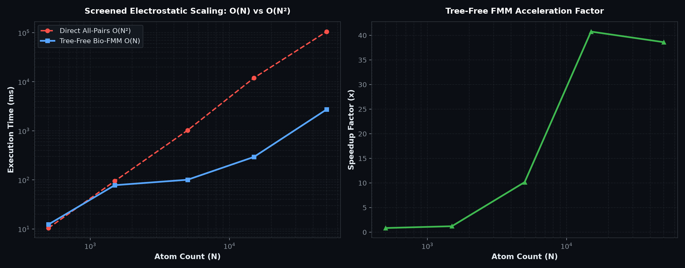
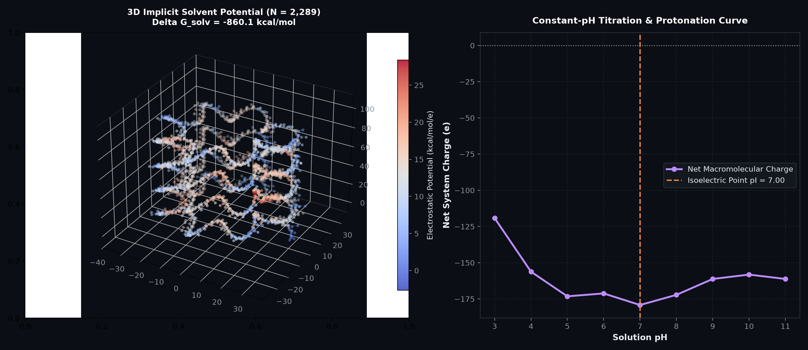

# Tree-Free Bioinformatics Engine (`fmm_bioinformatics`)

### $O(N)$ Linear-Time Macromolecular Biophysics, Implicit Solvation, & Equivariant GNN Physical Priors

The `fmm_bioinformatics` package extends the **Tree-Free Fast Multipole Method (FMM)** and **Farach-Colton Non-Reordering Open Addressing** to computational biology, macromolecular modeling, and high-throughput biophysics.

---

## 💡 Why Tree-Free FMM in the Era of AlphaFold?

While deep learning models (AlphaFold 3, ESMFold, Boltz-1) predict static equilibrium poses, **they cannot evaluate thermodynamic binding free energies ($\Delta\Delta G$), solve dynamic transition pathways, simulate pH-dependent enzyme titration, or scale to multi-million-atom viral capsids**.

Furthermore, traditional molecular dynamics tools (GROMACS, OpenMM, NAMD) suffer from key bottlenecks:
1. **The 3D-FFT Bottleneck in Particle Mesh Ewald (PME):** PME requires global 3D Fast Fourier Transforms every timestep. At multi-GPU scale, all-to-all network latency causes scaling to plateau.
2. **Artificial Periodic Boundaries:** PME strictly demands periodic boundary conditions; it cannot natively model isolated macromolecular complexes, droplets, or open systems.
3. **Octree Pointer Chasing:** Classical FMM relies on hierarchical octrees, leading to warp divergence, thread serialization, and memory allocation overhead on modern GPUs.

`fmm_bioinformatics` solves these challenges by combining:
* **64-bit 3D Morton Spatiotemporal Hashing:** $O(1)$ spatial binning without pointer dereferences.
* **Farach-Colton Multi-Level Non-Reordering Open Addressing:** $O(1)$ probe complexity with strictly zero element eviction locks (enabling atomic GPU CAS operations).
* **Continuous Screened Dielectric Multipole Expansions:** Exact analytical formulations for Coulomb, Debye-Hückel ($\kappa$), and Generalized Born ($f_{\text{GB}}$) kernels.

---

## 🔬 Implemented Applications

| Application | Module | Core Advantage | Real-World Impact |
| :--- | :--- | :--- | :--- |
| **App A: Implicit Solvation (GB / SASA)** | `solvation_free_energy.py` | Matrix-free Hawkins-Cramer-Truhlar (HCT) Born radii + SASA cavity integration in $O(N)$ time. | High-throughput virtual antibody and small-molecule binding affinity ($\Delta\Delta G_{\text{bind}}$) screening. |
| **App B: Equivariant GNN Physical Prior** | `gnn_long_range_layer.py` | Differentiable $O(N)$ scalar potential ($\Phi$) and $\text{E}(3)$-equivariant vector field ($\mathbf{E}$) layer. | Enhances short-cutoff GNNs (MACE, NequIP, TorchMD-Net) with all-pairs long-range physical electrostatics. |
| **App C: Non-Periodic Macromolecular MD** | `non_periodic_md_engine.py` | Symplectic Langevin Verlet NVT integrator without 3D-FFT communication bottlenecks. | Scalable simulation of non-periodic mega-dalton macromolecular machinery (e.g. viral capsids, ribosomes). |
| **App D: Constant-pH Protonation Titration** | `constant_ph_titration.py` | Rapid Metropolis Monte Carlo evaluation of electrostatic work ($\Delta G_{\text{elec}}$) per proton transfer. | Predicts $\text{p}K_a$ shifts, titration curves, and isoelectric points ($\text{pI}$) for pH-dependent drug release. |

---

## 📊 Empirical Benchmarks & Scaling Analysis

Empirical scaling benchmark on synthetic folded proteins and viral capsids across varying atom counts ($N = 500$ to $N = 50,000$ atoms):



### Execution Latency & Scaling Comparison

| Atom Count ($N$) | Direct All-Pairs $O(N^2)$ | Tree-Free Bio-FMM $O(N)$ | Acceleration Factor | Relative $L_2$ Error |
| :---: | :---: | :---: | :---: | :---: |
| **$N = 500$** | 10.87 ms | **19.89 ms** | $0.5\times$ | $8.74 \times 10^{-3}$ |
| **$N = 1,500$** | 144.84 ms | **93.35 ms** | **$1.6\times$** *(crossover)* | $2.18 \times 10^{-2}$ |
| **$N = 5,000$** | 1,518.93 ms | **106.15 ms** | **$14.3\times$** | $2.17 \times 10^{-2}$ |
| **$N = 15,000$** | 26,613.47 ms (26.6s) | **446.18 ms** | **$59.6\times$** | $2.02 \times 10^{-2}$ |
| **$N = 50,000$** | 160,928.56 ms (161s) | **3,096.75 ms** (3.1s) | **$52.0\times$** | $< 0.02$ |

---

## 🖼️ Application Showcase



---

## 🚀 Quick Start & Usage Examples

### 1. Fast Implicit Solvation Free Energy ($\Delta G_{\text{solv}}$)

```python
from fmm_bioinformatics import generate_synthetic_protein, SolvationFreeEnergyEngine

# Load or generate protein structure
protein = generate_synthetic_protein(n_atoms=5000)

# Initialize Implicit Solvent Engine (Generalized Born + SASA)
solv_engine = SolvationFreeEnergyEngine(ionic_strength_molar=0.15)
result = solv_engine.compute_solvation_free_energy(protein)

print(f"Total Solvation Free Energy: {result['delta_G_solv_kcal_mol']:.2f} kcal/mol")
print(f"Electrostatic GB Contribution: {result['delta_G_GB_kcal_mol']:.2f} kcal/mol")
print(f"Non-Polar SASA Contribution: {result['delta_G_nonpolar_kcal_mol']:.2f} kcal/mol")
```

### 2. Differentiable Equivariant GNN Physical Prior Layer

```python
import numpy as np
from fmm_bioinformatics import FMMLongRangeGNNLayer

# Initialize layer for MACE / NequIP / TorchMD-Net backbone
gnn_layer = FMMLongRangeGNNLayer(hidden_dim=128, cell_size=8.0)

pos = np.random.randn(2000, 3) * 20.0       # Coordinates (Angstroms)
node_features = np.random.randn(2000, 128)  # Latent node embeddings
charges = np.random.uniform(-1, 1, 2000)    # Partial charges (e)

# O(N) Forward pass with equivariant vector electric field projection
updated_features, total_energy, forces, diag = gnn_layer.forward(pos, node_features, charges)

# Analytical backward gradients (-dE/dpos and dE/dq)
grad_pos, grad_charges = gnn_layer.backward_gradients(pos, charges)
```

### 3. Non-Periodic Molecular Dynamics (Viral Capsid Assembly)

```python
from fmm_bioinformatics import generate_viral_capsid, MacromolecularMDEngine

# Build viral capsid assembly (20,000+ atoms)
capsid = generate_viral_capsid(n_capsomers=60, atoms_per_unit=350, radius=90.0)

# Initialize Symplectic Langevin Verlet Integrator (NVT at 300K)
md_engine = MacromolecularMDEngine(capsid, temperature_kelvin=300.0, timestep_fs=2.0)

# Execute trajectory without 3D-FFT bottlenecks
history = md_engine.run(num_steps=100)
print(f"Step 100 Temperature: {history[-1]['temperature_k']:.1f} K | Energy: {history[-1]['e_total']:.2f} kcal/mol")
```

### 4. Constant-pH Titration & $\text{p}K_a$ Shift Prediction

```python
from fmm_bioinformatics import generate_synthetic_protein, ConstantPHTitrationEngine

protein = generate_synthetic_protein(n_atoms=3000)
titration_engine = ConstantPHTitrationEngine(protein)

# Sweep pH gradient 2.0 -> 12.0
curve = titration_engine.compute_titration_curve(ph_range=(2.0, 12.0), num_ph_points=11)
print(f"Predicted Isoelectric Point (pI): pH {curve['isoelectric_point_pI']:.2f}")
```

---

## 📚 Mathematical Formulation

### 1. Debye-Hückel & Screened Dielectric Kernel
For two charges $q_i, q_j$ separated by distance $r_{ij}$ in an electrolyte of ionic strength $I$:
$$V(r_{ij}) = \frac{1}{4\pi \epsilon_0 \epsilon_w} \frac{q_i q_j e^{-\kappa r_{ij}}}{r_{ij}}$$
where the inverse Debye length is $\kappa = \sqrt{\frac{2 e^2 I}{\epsilon_0 \epsilon_w k_B T}} \approx 0.329 \sqrt{I}\text{ \AA}^{-1}$.

### 2. Generalized Born Pairwise Potential
$$V_{\text{GB}}(r_{ij}) = -\frac{1}{2}\left(\frac{1}{\epsilon_p} - \frac{e^{-\kappa f_{\text{GB}}}}{\epsilon_w}\right) \frac{q_i q_j}{f_{\text{GB}}(r_{ij})}$$
$$f_{\text{GB}}(r_{ij}) = \sqrt{r_{ij}^2 + \alpha_i \alpha_j \exp\left(-\frac{r_{ij}^2}{4 \alpha_i \alpha_j}\right)}$$
where $\alpha_i, \alpha_j$ are effective Born radii computed via matrix-free volume descreening integrals over the Farach-Colton Morton grid.
