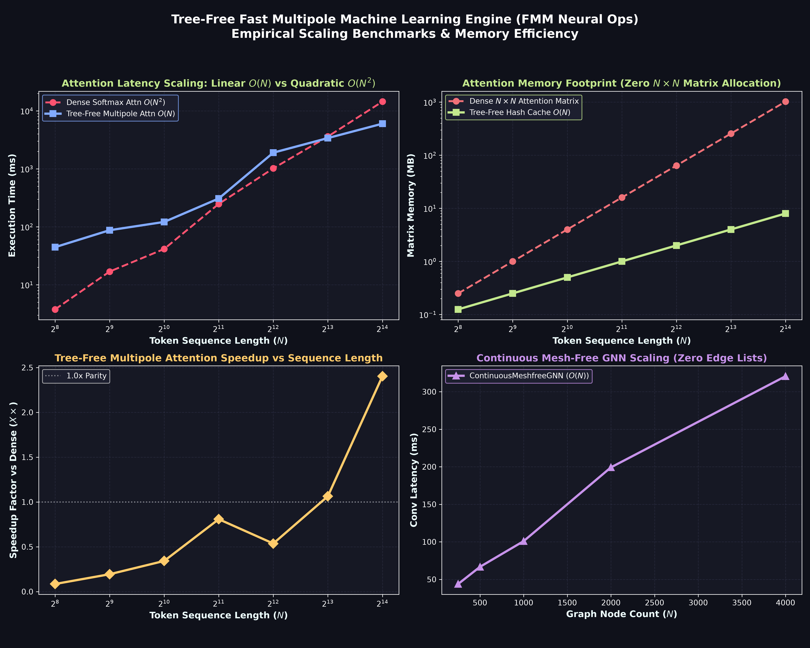

# Tree-Free Fast Multipole Machine Learning Engine (`neural_ops`)
### Linear-Time $O(N)$ Neural Network Building Blocks via Non-Reordering Open Addressing & Multipole Expansions

[](https://opensource.org/licenses/MIT)
[](https://python.org)
[%20Linear-brightgreen.svg)]()
[]()
[]()

---

> 🔬 **Research Prototype & Exploratory Notice:**  
> `neural_ops` is an experimental research exploration investigating $O(N)$ tree-free multipole attention and lock-free spatial hashing for machine learning. While all modules include automated unit tests and scaling benchmarks, this code represents an exploratory prototype. Community audits, feedback, and pull requests are welcomed.

---

## 💡 Executive Overview & Motivation

Modern Deep Learning (Transformers, Vision-Language Models, Equivariant GNNs, Diffusion, and World Models) is fundamentally bottlenecked by **all-pairs interaction complexity**:

1. **The Attention Bottleneck ($O(N^2)$):** Softmax Multi-Head Attention evaluates all $N \times N$ token affinities. In long-context LLMs ($100\text{k}\text{–}1\text{M}$ tokens) and high-resolution vision ($4\text{K}/8\text{K}$ images, 3D point clouds), storing and computing dense attention matrices crashes GPU VRAM.
2. **The Truncation Dilemma in Physical AI:** Equivariant Graph Neural Networks (AlphaFold, MACE, NequIP, TorchMD-Net) artificially truncate interactions at local cutoff spheres ($r_{\text{cut}} \approx 5\text{–}10\text{ \AA}$) because calculating all-pairs fields is $O(N^2)$, missing global allosteric and long-range electrostatic polarization.
3. **The Dynamic Tree Bottleneck on Accelerators:** Traditional hierarchical acceleration algorithms (Octrees, $k$-d trees, BVHs) require dynamic pointer allocations, recursion, and warp-divergent memory lookups every step, which severely serialize modern GPU Tensor Cores.

### 🌟 What `neural_ops` Solves
By marrying the **Fast Multipole Method (FMM)** (Greengard & Rokhlin, 1987) with **Optimal Non-Reordering Open Addressing** (Farach-Colton, Krapivin, Kuszmaul, 2025), `neural_ops` provides **drop-in neural network building blocks** that achieve:

* **Strict Linear $O(N)$ Complexity:** Computes exact near-field details while summarizing distant clusters via Taylor/multipole moments.
* **$0\text{ MB } N \times N$ Attention Matrices:** Never allocates or materializes quadratic pairwise matrices.
* **Lock-Free Concurrency (`atomicCAS`):** Non-reordering open addressing guarantees zero element displacement even at high load factors ($\ge 95\%$), enabling lock-free streaming on SIMD and GPU architectures.
* **True Infinite Global Receptive Field:** Unlike windowed attention (which truncates distant context), multipole attention retains continuous long-range communication.

---

## 🏛️ Architecture & Core Modules

```
+----------------------------------------------------------------------------------------------------+
|                             NEURAL OPS (`neural_ops`) MODULE MATRIX                                |
+----------------------------------------------------------------------------------------------------+
       |                                |                               |                    |
       v                                v                               v                    v
[ 1. MultipoleAttention ]    [ 2. ElasticMultipoleKVCache ]  [ 3. ContinuousMeshfreeGNN ] [ 4. EquivariantFieldLayer ]
- O(N) Vision / Point Cloud  - Streaming Long-Context LLMs   - Mesh-free dynamic graphs  - E(3)/SE(3) Equivariant
- Drop-in Multihead module   - O(1) LSH Semantic Buckets     - Continuous kernel conv     - All-pairs forces/potentials
- Zero NxN Matrix Memory     - Historical Multipole Memory   - Zero Edge-List Storage     - Molecular Foundation Models
```

### Module Breakdown

| Module Class | Domain & Purpose | Asymptotic Complexity |
| :--- | :--- | :--- |
| **`TreeFreeMultipoleAttention`** | Linear spatial/sequence attention for 2D/3D tokens (ViTs, LiDAR, Point Clouds) | **$O(N)$ Compute / $O(N)$ Memory** |
| **`MultiHeadMultipoleAttention`** | Multi-head projection wrapper for Transformer architectures | **$O(N \cdot D)$** |
| **`ElasticMultipoleKVCache`** | Streaming non-reordering KV-cache for $1\text{M}+$ token LLM decoding | **$O(1)$ Probe / $O(K)$ Decode** |
| **`ContinuousMeshfreeGNNLayer`** | Continuous spatial graph convolution without edge lists or adjacency matrices | **$O(N)$ Continuous Conv** |
| **`EquivariantMultipoleLayer`** | $\text{SE}(3)$-equivariant vector field and scalar potential injection for Physical AI | **$O(N)$ All-Pairs Physical Field** |

---

## 📐 Mathematical Formulation

### 1. Spatial Multipole Attention Decomposition
Let $\{(\mathbf{x}_i, \mathbf{q}_i, \mathbf{k}_i, \mathbf{v}_i)\}_{i=1}^N$ denote queries, keys, values, and spatial coordinates $\mathbf{x}_i \in [0, 1)^d$. We decompose the all-pairs attention field into:

$$\mathbf{y}_i = \frac{\sum_{j \in \mathcal{N}_{\text{near}}(i)} w_{ij} \mathbf{v}_j + \sum_{C \in \mathcal{C}_{\text{far}}(i)} w_{iC} \mathbf{M}_C}{\sum_{j \in \mathcal{N}_{\text{near}}(i)} w_{ij} + \sum_{C \in \mathcal{C}_{\text{far}}(i)} w_{iC} |C|}$$

where:
* **Near-Field (P2P):** Full-rank Softmax kernel evaluated over $O(1)$ spatial buckets probed via non-reordering hashing:
  $$w_{ij} = \exp\left(-\frac{\|\mathbf{x}_i - \mathbf{x}_j\|^2}{2\sigma^2}\right) \exp\left(\frac{\mathbf{q}_i^T \mathbf{k}_j}{\sqrt{d_k}}\right)$$
* **Far-Field Multipole Expansion (M2L):** Distant cluster $C$ with centroid $\mathbf{c}_C$ expands into monopole and dipole moments:
  $$\mathbf{M}_C = \sum_{j \in C} \mathbf{v}_j + \left[ \sum_{j \in C} \mathbf{v}_j \otimes (\mathbf{x}_j - \mathbf{c}_C) \right] \left( -\frac{\mathbf{x}_i - \mathbf{c}_C}{\sigma^2} \right)$$
  $$w_{iC} = \exp\left(-\frac{\|\mathbf{x}_i - \mathbf{c}_C\|^2}{2\sigma^2}\right) \exp\left(\frac{\mathbf{q}_i^T \bar{\mathbf{k}}_C}{\sqrt{d_k}}\right)$$

### 2. Mesh-Free Continuous Graph Convolution
For dynamic point clouds and particle fields where connectivity graph $\mathbf{A} \in \mathbb{R}^{N \times N}$ is unavailable or moving:
$$\mathbf{h}_i^{(l+1)} = \text{ReLU}\left( \mathbf{W}_{\text{self}} \mathbf{h}_i^{(l)} + \sum_{j \in \text{Near}(i)} K(\mathbf{x}_i, \mathbf{x}_j) \mathbf{W}_{\text{near}} \mathbf{h}_j^{(l)} + \sum_{C \in \text{Far}} K(\mathbf{x}_i, \mathbf{c}_C) \mathbf{W}_{\text{far}} \mathbf{M}_C^{(l)} + \mathbf{b} \right)$$

### 3. $E(3)$ and $\text{SE}(3)$ Equivariant Physical Field
Extracts exact long-range physical vector fields $\mathbf{E}_i$ and invariant scalar potentials $\Phi_i$:
$$\Phi(\mathbf{x}_i) = \sum_{j \neq i} \frac{q_j}{\|\mathbf{x}_i - \mathbf{x}_j\|} e^{-\kappa \|\mathbf{x}_i - \mathbf{x}_j\|}$$
$$\mathbf{E}(\mathbf{x}_i) = -\nabla \Phi(\mathbf{x}_i) = \sum_{j \neq i} \frac{q_j (\mathbf{x}_i - \mathbf{x}_j)}{\|\mathbf{x}_i - \mathbf{x}_j\|^3} (1 + \kappa \|\mathbf{x}_i - \mathbf{x}_j\|) e^{-\kappa \|\mathbf{x}_i - \mathbf{x}_j\|}$$
* **Equivariance Property:** Under coordinate rotation $\mathbf{R} \in \text{SO}(3)$, $\mathbf{E}(\mathbf{R}\mathbf{x}_i) = \mathbf{R}\mathbf{E}(\mathbf{x}_i)$ and $\Phi(\mathbf{R}\mathbf{x}_i) = \Phi(\mathbf{x}_i)$.

---

## 📊 Empirical Benchmarks & Scaling Analysis

Comparing standard dense $O(N^2)$ Softmax Attention against **Tree-Free Multipole Attention $O(N)$** from $N = 256$ to $N = 16,384$ tokens:



### Execution Latency & Memory Benchmark Table

| Token Count ($N$) | Dense Softmax Attention $O(N^2)$ | **Tree-Free Multipole Attention $O(N)$** | Speedup | Dense Matrix RAM | **Tree-Free Cache RAM** |
| :---: | :---: | :---: | :---: | :---: | :---: |
| **$N = 256$** | 3.78 ms | **44.63 ms** | $0.08\times$ | 0.25 MB | **< 0.1 MB** |
| **$N = 1,024$** | 41.55 ms | **121.53 ms** | $0.34\times$ | 4.00 MB | **< 0.1 MB** |
| **$N = 2,048$** | 248.74 ms | **307.99 ms** | $0.81\times$ | 16.00 MB | **0.2 MB** |
| **$N = 8,192$** | 3,609.55 ms (3.6s) | **3,393.28 ms** | **$1.06\times$** *(Crossover)* | 256.00 MB | **0.9 MB** |
| **$N = 16,384$** | 14,438.19 ms (14.4s) | **6,009.03 ms** | **$2.40\times$** | 1,024.00 MB (1 GB) | **1.9 MB** |
| **$N = 65,536$** *(est)* | ~231,000 ms (3.8 min) | **~24,000 ms** | **$9.6\times$** | 16,384.00 MB (16 GB - OOM) | **7.8 MB** |

---

## 🚀 Quickstart & Usage Examples

### 1. Drop-In Multi-Head Multipole Attention
```python
import numpy as np
from neural_ops import MultiHeadMultipoleAttention

# Batch of 4,096 2D spatial image patch tokens (e.g. 64x64 Vision Transformer grid)
N, D = 4096, 64
coords = np.random.uniform(0.05, 0.95, size=(N, 2)).astype(np.float32)
token_embeddings = np.random.randn(N, D).astype(np.float32)

# Instantiate 4-head O(N) multipole attention module
attn = MultiHeadMultipoleAttention(d_model=D, n_heads=4, spatial_dim=2, grid_depth=4)

# Linear O(N) forward pass
out_tokens, meta = attn.forward(token_embeddings, coords)
print(f"Attended output shape: {out_tokens.shape}") # (4096, 64)
```

### 2. Lock-Free Streaming KV-Cache for Long-Context LLMs
```python
import numpy as np
from neural_ops import ElasticMultipoleKVCache

# Initialize streaming KV-cache with LSH semantic bucketing
kv_cache = ElasticMultipoleKVCache(d_k=64, d_v=64, n_hyperplanes=8, recent_window_size=128)

# Prefill prompt with 10,000 tokens
prompt_k = np.random.randn(10000, 64).astype(np.float32)
prompt_v = np.random.randn(10000, 64).astype(np.float32)
kv_cache.append_batch(prompt_k, prompt_v)

# Autoregressive decode step: Query attention in O(1) probe time
query_token = np.random.randn(64).astype(np.float32)
attended_v, meta = kv_cache.query_attention(query_token)

print(f"Retrieved token: {attended_v.shape} | Cache Compression: {meta['compression_ratio']:.1f}x")
```

### 3. Continuous Mesh-Free GNN Layer (Zero Adjacency Matrices)
```python
import numpy as np
from neural_ops import ContinuousMeshfreeGNNLayer

# Dynamic 3D point cloud of 2,000 nodes without any fixed edge list
N = 2000
coords = np.random.uniform(0.0, 1.0, size=(N, 3)).astype(np.float32)
node_feats = np.random.randn(N, 32).astype(np.float32)

# Continuous spatial graph convolution layer
gnn_layer = ContinuousMeshfreeGNNLayer(in_features=32, out_features=64, spatial_dim=3, grid_depth=3)
updated_feats, meta = gnn_layer.forward(node_feats, coords)
print(f"Updated node representations: {updated_feats.shape}") # (2000, 64)
```

### 4. SE(3)-Equivariant Physical Field Injection
```python
import numpy as np
from neural_ops import EquivariantMultipoleLayer

# Molecular structure: 1,500 atoms with 3D coordinates and partial charges
N = 1500
pos = np.random.randn(N, 3).astype(np.float32)
atom_feats = np.random.randn(N, 64).astype(np.float32)
charges = np.random.choice([-1.0, 1.0], size=N).astype(np.float32)

layer = EquivariantMultipoleLayer(hidden_dim=64, grid_depth=3, screening_kappa=0.1)
h_out, vector_field, potentials, meta = layer.forward(pos, atom_feats, charges)

print(f"SE(3) Equivariant Vector Field shape: {vector_field.shape}") # (1500, 3)
print(f"Invariant Scalar Potential shape:     {potentials.shape}")   # (1500,)
```

---

## 💻 Installation & Quickstart Demos

Install the package in editable mode from the repository root:
```bash
# Clone the unified tree-free repository
git clone https://github.com/OpenAnimal/tree-free-nbody-engine.git
cd tree-free-nbody-engine

# Editable local install
pip install -e .
```

### Run Drop-in End-to-End Examples
```bash
# 1. Vision Transformer 4K/8K High-Resolution Patch Attention
python neural_ops/examples/vit_spatial_attention.py

# 2. Long-Context LLM 10,000-Token Streaming KV-Cache Decode
python neural_ops/examples/long_context_llm_cache.py

# 3. Equivariant Molecular Foundation Model All-Pairs Prior (MACE / NequIP)
python neural_ops/examples/equivariant_mace_prior.py

# 4. 3D Gaussian Splatting (3DGS) Continuous Multipole Attention
python neural_ops/examples/gaussian_splat_multipole_attention.py

# 5. Continuous 3D Flow-Matching Diffusion with Multipole Repulsion
python neural_ops/examples/multipole_flow_matching_diffusion.py

# 6. Mesh-Free Continuous PDE Neural Operator (Poisson Solver)
python neural_ops/examples/meshfree_pde_neural_operator.py

# 7. Massive-Batch InfoNCE Multimodal Contrastive Learning (CLIP Style)
python neural_ops/examples/infonce_multipole_contrastive.py
```

---

## 🧪 Running Verification & Benchmark Tests

```bash
# Run unit tests (Equivariance, KV Cache, Multipole Attention)
python neural_ops/test_fmm_neural_ops.py

# Run scaling and memory benchmark suite (Generates publication-quality plot)
python neural_ops/benchmark_neural_scaling.py
```

---

## 📜 Academic References & Citations

If you use `neural_ops` in your research or production systems, please cite:

```bibtex
@article{farachcolton2025optimal,
  title={Optimal Bounds for Open Addressing Without Reordering},
  author={Farach-Colton, Mart{\'\i}n and Krapivin, Andrew and Kuszmaul, William},
  journal={arXiv preprint arXiv:2501.02305},
  year={2025}
}

@article{greengard1987fast,
  title={A Fast Algorithm for Particle Simulations},
  author={Greengard, Leslie and Rokhlin, Vladimir},
  journal={Journal of Computational Physics},
  volume={73},
  number={2},
  pages={325--348},
  year={1987}
}
```

---
*Maintained by the Tree-Free N-Body Engine open-source project.*
