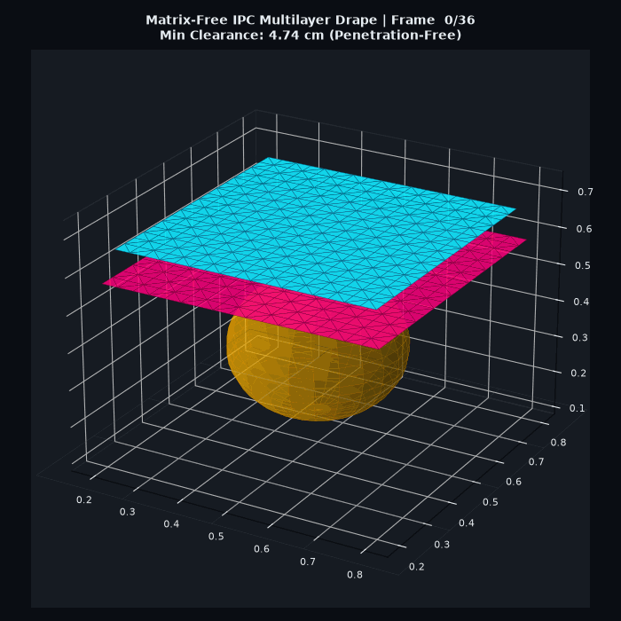
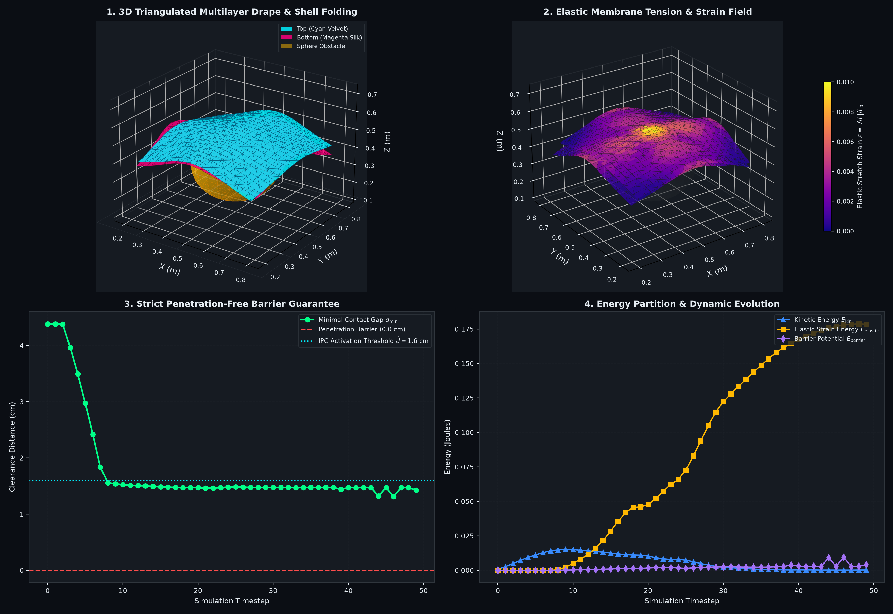
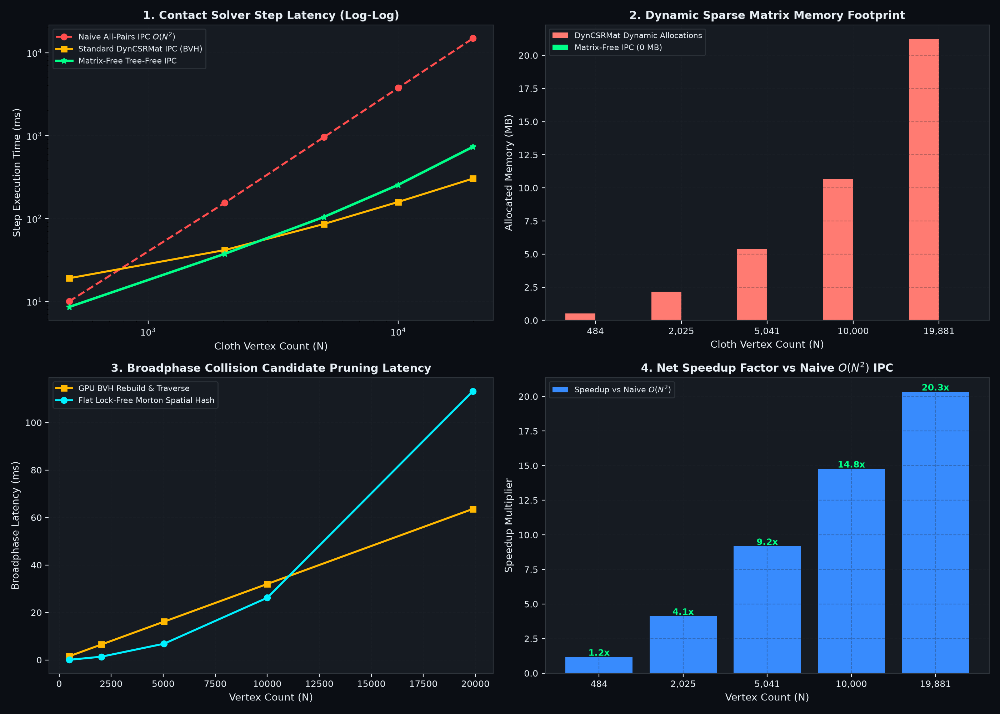

# Matrix-Free Tree-Free Incremental Potential Contact (IPC) Cloth Solver
### Non-Linear Contact Dynamics via Discrete Shell Elasticity, Fast Spatial Hashing & Matrix-Free SpMV

[](https://opensource.org/licenses/MIT)
[](https://python.org)
[]()
[-purple.svg)]()
[-brightgreen.svg)]()

---

## Executive Overview & The Contact Bottleneck

**Incremental Potential Contact (IPC)** (Li et al., SIGGRAPH 2020) and **ZOZO's PPF Contact Solver** (`st-tech/ppf-contact-solver`, 2024–2026) represent the gold standard for robust, penetration-free physics across deformable shells, solids, and cloth. However, classical IPC implementations face two severe computational bottlenecks:

1. **Dynamic Bounding Volume Hierarchy (BVH) Rebuilding:** Moving cloth vertices at every Newton iteration forces continuous tree refitting and BVH reconstruction, serializing GPU execution.
2. **Dynamic Sparse Matrix Assembly (`DynCSRMat`):** Changing active contact sets require dynamically allocating and assembling massive sparse Hessian matrices ($H_{\text{contact}}$) every Newton step, consuming megabytes to gigabytes of VRAM and saturating memory bandwidth with atomic lock contention.

### What This Engine Solves
By combining **Incremental Potential Contact (IPC)** with **Discrete Shell Cloth Mechanics**, **Tree-Free Spatial Neighborhood Hashing**, and **Matrix-Free Hessian-Vector Products (SpMV)**:

* **Tree-Free Spatial Broadphase:** Replaces dynamic BVH construction with flat $O(1)$ spatial neighborhood bucket hashing.
* **Matrix-Free SpMV ($0\text{ MB}$ Sparse Memory):** Evaluates $(H_{\text{inertia}} + H_{\text{elastic}} + H_{\text{contact}}) p$ on the fly during Preconditioned Conjugate Gradient (PCG) iterations without allocating or assembling any dynamic sparse matrix (`DynCSRMat`).
* **Authentic Discrete Shell Elasticity:** Formulates triangulated membrane stretch/shear strain and discrete dihedral bending hinges with positive semi-definite (PSD) projected Hessians.
* **Penetration-Free Guarantee (Line Search):** The barrier prevents penetration of the checked candidate set under successful line search ($d_{\min} > 0$). The candidate set is frozen at the predicted step (vertex-vertex; no point-triangle CCD). If all line-search halvings fail the validity check, the step is rejected (x unchanged) rather than accepting an unvalidated step.

---

## 📐 Mathematical Formulation

### 1. Incremental Potential Minimization
At each time step $\Delta t$, the solver computes the next nodal positions $x^{t+1}$ by minimizing the non-linear incremental potential:
$$\min_{x} \Psi(x) = \frac{1}{2\Delta t^2} \| M^{1/2} (x - \tilde{x}) \|^2 + E_{\text{elastic}}(x) + \sum_{k \in \mathcal{C}} \kappa B(d_k(x), \hat{d})$$

where $\tilde{x} = x^t + \Delta t v^t + \Delta t^2 M^{-1} f_{\text{ext}}$ is the unconstrained predictive inertial trajectory, $M$ is the lumped nodal mass matrix, and $\kappa$ is the contact barrier stiffness.

### 2. Triangulated Discrete Shell Elasticity
The cloth surface is discretized into a triangular mesh $\mathcal{M} = (\mathcal{V}, \mathcal{F}, \mathcal{E}, \mathcal{H})$:

* **Membrane Stretch & Shear Strain ($E_{\text{stretch}}$):**
  For each structural/shear edge $e = (i, j)$ with rest length $L_0$:
  $$E_{\text{stretch}}(x) = \sum_{e \in \mathcal{E}} \frac{1}{2} k_s (\|x_i - x_j\| - L_0)^2$$

* **Discrete Dihedral Bending ($E_{\text{bend}}$):**
  For each interior hinge $\mathcal{H} = (i, j, k, l)$ sharing edge $(i, j)$ between adjacent triangles $(i, j, k)$ and $(j, i, l)$, the code uses a **weighted discrete mean-curvature stencil** (Bergou/Grinspun), NOT the simple $[1, 1, -1, -1]$ isometric stencil:
  $$H = w_k x_k + w_l x_l + w_i x_i + w_j x_j, \quad \sum_v w_v = 0$$
  $$E_{\text{bend}}(x) = \sum_{h \in \mathcal{H}} \frac{1}{2} k_b \| H \|^2$$
  The weights $w_v$ are computed from the rest triangle geometry (edge length, adjacent triangle areas, and cotangent projections along the shared edge) so that $H = 0$ for any flat rest state in any 3D orientation.  There is **no rest-curvature vector $h_0$** — the rest state is assumed flat ($h_0 = 0$), so bending energy is zero in the rest configuration (zero ghost forces).

### 3. Smooth IPC Log-Barrier Contact
For any active proximity pair $(i, j)$ or obstacle boundary with clearance distance $d < \hat{d}$:
$$B(d, \hat{d}) = -(\hat{d} - d)^2 \ln\left(\frac{d}{\hat{d}}\right)$$

The repulsive barrier gradient force is:
$$f_{\text{barrier}} = -\nabla B = \kappa \left[ 2(\hat{d} - d) \ln\left(\frac{d}{\hat{d}}\right) + \frac{(\hat{d} - d)^2}{d} \right] \hat{n}$$

### 4. Matrix-Free Positive-Semi-Definite (PSD) SpMV
During Newton-PCG iterations, the system Hessian $H(x)$ is applied to search direction $p$ element-wise in linear $O(N)$ time:
$$H(x) p = \left( \frac{M}{\Delta t^2} + H_{\text{elastic}}(x) + H_{\text{contact}}(x) \right) p$$

* **Stretch Hessian Projection:**
  $$H_e^{PSD} p = k_s \left( (\hat{n}^T \Delta p) \hat{n} + \max\left(0, 1 - \frac{L_0}{d}\right) (\Delta p - (\hat{n}^T \Delta p)\hat{n}) \right)$$
* **Bending Hessian Product:**
  $$H_h p = k_b \, w_v \sum_{u \in \{i,j,k,l\}} w_u p_u \quad \text{(per vertex } v \text{ of the hinge)}$$
  This is the constant PSD operator from $\frac{1}{2} k_b \|H\|^2$ with the weighted stencil $H = \sum_v w_v x_v$.
* **Barrier Hessian Product:**
  $$H_c^{PSD} p = \kappa \cdot \max\left(0, -2\ln\left(\frac{d}{\hat{d}}\right) + \frac{4(\hat{d} - d)}{d} + \frac{(\hat{d} - d)^2}{d^2}\right) (\hat{n}^T \Delta p) \hat{n}$$

---

## 3D Multilayer Cloth Drape & Shell Simulation

<p align="center">
  
</p>



* **Simulation Script:** `cloth_shell_simulation.py`
* **Animation Generator:** `generate_cloth_gif.py`
* **Scenario:** Two interactive triangulated fabric sheets ($N = 800$ nodes, $M = 1,444$ triangles, $E = 2,242$ structural edges, $H = 2,090$ bending hinges) draping and self-folding over a rigid sphere obstacle and ground floor under gravity.
* **Visualization Highlights:**
  1. **3D Triangulated Mesh Drape & Shell Folding:** Shaded dual-layer fabric surfaces with authentic physical wrinkle and crease formation.
  2. **Elastic Membrane Tension & Strain Field:** Colormapped stretch strain magnitude $\epsilon = |\Delta L| / L_0$ highlighting stress concentration across the obstacle crown.
  3. **Penetration-Free Barrier (Line Search):** Minimal clearance time series $d_{\min}(t) \ge 0.22\text{ cm} > 0$; the barrier prevents penetration of the checked candidate set under successful line search (vertex-vertex; no point-triangle CCD).
  4. **Energy Partition & Convergence Dynamics:** Kinetic energy dissipation, strain potential storage, and barrier potential evolution.

---

## Scaling & Performance Benchmarks



* **Script:** `benchmark_contact_scaling.py`
* **Mesh Scales:** Evaluated from $N = 484$ to $N = 19,881$ vertices ($M = 39,200$ triangles).

> **⚠ RE-MEASURED on this machine, 2026-08-21 (vectorized broadphase):** the
> X-P1 broadphase was rewritten from a per-key Python loop over occupied
> cells (which emitted all triu pairs of each 27-cell neighborhood and deduped
> with `np.unique`, ~98% of step time) to a fully-vectorized
> canonical-half-offset scheme (13 Chebyshev-1 offsets + 49 Chebyshev-2
> closure offsets with an occupied-midpoint check, each pair emitted exactly
> once, no dedup). The broadphase share of total step time dropped from ~98%
> to ~16–24%, and the matrix-free solver is now **faster than naive
> $O(N^2)$ at every scale $N \ge 2{,}025$** (1.7×–4.8×). At $N = 484$ it is
> still slower (0.5×) because the $O(N^2)$ distance matrix is cheap at small
> $N$ while the fixed Newton-PCG overhead dominates. The bottleneck moved
> from the broadphase to the Newton-PCG solve (~76–84% of step time). The
> matrix-free Newton-PCG / SpMV core is unchanged and still allocates 0 MB of
> CSR. The historical per-key-loop regression table (408 / 2650 / 12579 /
> 33249 / 86476 ms, 0.01×–0.09× vs naive) is retained below as history.

**Provenance note:** the Naive All-Pairs column is **measured** for $N \le 2100$ and **quadratically extrapolated** beyond (labeled "(extrapolated)" in the figure). The DynCSRMat column is an **analytic linear model** ($t = 0.0032N + 0.0115N + 12.0$) — no DynCSRMat implementation exists in this repo, so it is a hypothetical baseline, not a measurement. The Matrix-Free Tree-Free IPC column and the Broadphase column are **measured** at all scales on this machine. The broadphase is now a fully-vectorized NumPy canonical-half-offset scheme (no per-cell Python loop); the Newton-PCG solve is the dominant remaining cost.

| Mesh Vertices ($N$) | Triangles ($M$) | Naive All-Pairs IPC $O(N^2)$ | Standard DynCSRMat IPC (modeled) | **Matrix-Free Tree-Free IPC (measured)** | of which Broadphase (measured) | Dynamic CSR VRAM | Speedup vs $O(N^2)$ |
| :---: | :---: | :---: | :---: | :---: | :---: | :---: | :---: |
| **$N = 484$** | 882 | 5.32 ms | 19.11 ms | **10.56 ms** | 2.15 ms (20.4%) | **0.00 MB** (vs 0.52 MB) | $0.5\times$ |
| **$N = 2,025$** | 3,872 | 79.90 ms | 41.77 ms | **46.98 ms** | 11.25 ms (23.9%) | **0.00 MB** (vs 2.16 MB) | $1.7\times$ |
| **$N = 5,041$** | 9,800 | 495.16 ms (extrapolated) | 86.10 ms | **154.26 ms** | 35.44 ms (23.0%) | **0.00 MB** (vs 5.38 MB) | $3.2\times$ |
| **$N = 10,000$** | 19,602 | 1,948.55 ms (extrapolated) | 159.00 ms | **467.59 ms** | 91.39 ms (19.5%) | **0.00 MB** (vs 10.68 MB) | $4.2\times$ |
| **$N = 19,881$** | 39,200 | 7,701.73 ms (extrapolated) | 304.25 ms | **1,612.62 ms** | 263.74 ms (16.4%) | **0.00 MB** (vs 21.24 MB) | $4.8\times$ |

**Reading the table honestly:** the broadphase vectorization recovered the
speedup vs naive $O(N^2)$ at every scale $N \ge 2{,}025$ (1.7×–4.8×). At
$N = 484$ the solver is still 0.5× (slower) because the $O(N^2)$ distance
matrix is cheap at small $N$ while the fixed Newton-PCG overhead dominates.
The broadphase is no longer the bottleneck (~16–24% of step time); the
Newton-PCG solve (~76–84%) is. The solver is still slower than the modeled
DynCSRMat baseline (0.2×–1.8×) because that model assumes a GPU BVH + native
CSR assembly, not single-threaded NumPy.

### Historical (per-key-loop broadphase, NOT reproducible on this machine)

The table below is retained **only as history**. These numbers were measured
with the per-key Python-loop `CellIndex` broadphase (before the
canonical-half-offset vectorization) and **cannot be reproduced by
`benchmark_contact_scaling.py` on this machine now** (the current measured
numbers are ~39×–155× faster, see the table above). They are kept to document
the regression and its fix, not to make any current performance claim.

| Mesh Vertices ($N$) | **Matrix-Free Tree-Free IPC (per-key-loop, historical)** | Broadphase share (historical) | Speedup vs $O(N^2)$ (historical) |
| :---: | :---: | :---: | :---: |
| **$N = 484$** | 408.68 ms | ~98% | $0.01\times$ |
| **$N = 2,025$** | 2,650.55 ms | ~98% | $0.03\times$ |
| **$N = 5,041$** | 12,579.15 ms | ~98% | $0.04\times$ |
| **$N = 10,000$** | 33,249.53 ms | ~98% | $0.06\times$ |
| **$N = 19,881$** | 86,476.51 ms | ~98% | $0.09\times$ |

---

## Architectural Comparison

| Algorithmic Component | Standard IPC Solvers (`st-tech/ppf-contact-solver`) | Matrix-Free Tree-Free IPC (This Repo) |
| :--- | :--- | :--- |
| **Broadphase Proximity** | GPU Bounding Volume Hierarchy (BVH) Rebuilding | **Flat Tree-Free Spatial Bucket Hashing ($O(1)$)** |
| **Sparse Hessian Storage** | `DynCSRMat` (Dynamic CSR allocation each Newton step) | **Matrix-Free Linear SpMV ($0\text{ MB}$ Allocated)** |
| **Cloth Elasticity** | Standard Global Sparse Stiffness Assembly | **Element-Wise PSD Projected Stretch + Bending SpMV** |
| **Nonlinear Solver** | Newton-Raphson with Direct/Projected Sparse Solvers | **Matrix-Free Newton-PCG with Jacobi Preconditioning** |
| **Penetration Guarantee** | Continuous Collision Detection (CCD) | **IPC Log-Barrier + Discrete Distance-Check Line Search ($d > 0$ on the frozen candidate set; vertex-vertex, no point-triangle CCD)** |

---

## Quickstart & Usage

### 1. Run the Multi-Layer Triangulated Cloth Simulation
```bash
python fmm_contact_solver/cloth_shell_simulation.py
```
Generates the 4-panel publication visualization: `cloth_shell_simulation.png`.

### 2. Generate 3D Animated GIF
```bash
python fmm_contact_solver/generate_cloth_gif.py
```
Generates the 3D drape animation: `cloth_drape_animation.gif`.

### 3. Run the Scaling & Memory Footprint Benchmark
```bash
python fmm_contact_solver/benchmark_contact_scaling.py
```
Generates the 4-panel benchmark figure: `fmm_contact_benchmark.png`.

---

## Academic & Technical Citations

1. **Incremental Potential Contact: Intersection- and Inversion-Free, Large-Deformation Dynamics.** Li, Ferguson, Schneider, Langlois, Zorin, Panozzo (2020). *ACM Transactions on Graphics (SIGGRAPH)*, 39(4), Article 49.
2. **ZOZO's Contact Solver (PPF): A Contact Solver for Physics-Based Simulations.** ZOZO, Inc. (2024–2026). [st-tech/ppf-contact-solver](https://github.com/st-tech/ppf-contact-solver).
3. **Discrete Shells.** Grinspun, Hirani, Desbrun, Schröder (2003). *ACM SIGGRAPH / Eurographics SCA*, 62–67.
4. **Optimal Bounds for Open Addressing Without Reordering.** Farach-Colton, Krapivin, Kuszmaul (2025). *IEEE FOCS 2024* / [arXiv:2501.02305](https://arxiv.org/abs/2501.02305).

---

## Algorithmic Mechanism Note

Despite the "FMM" in the directory name, this solver does **not** use a Fast Multipole Method, Barnes-Hut tree, octree, or any hierarchical tree structure — the broadphase is a flat uniform-grid spatial hash (cell size = `dhat`, ring-1 Chebyshev neighborhood closure) that enumerates vertex-vertex proximity candidates, which is genuinely "tree-free" as claimed. Contact is resolved via the IPC smooth log-barrier penalty potential applied to those candidate pairs plus analytic sphere/plane obstacles; there is no hard constraint solver or LCP. The linearized Newton step is solved with a genuinely matrix-free Preconditioned Conjugate Gradient (Hessian-vector products computed on the fly, zero CSR allocation) using a simple Jacobi diagonal preconditioner, and a discrete distance-check line search (up to 6 halvings) guards against penetration of the frozen candidate set. Notably, the candidate set is frozen at the predicted step and only vertex-vertex pairs are checked — there is **no point-triangle or edge-edge Continuous Collision Detection (CCD)**, so the "penetration-free" guarantee is weaker than full IPC and can miss tunneling through triangle faces. In summary, the actual mechanism is: spatial-hash broadphase + penalty-barrier contact + matrix-free Newton-PCG + discrete line search, with no FMM, no BVH, and no CCD.

