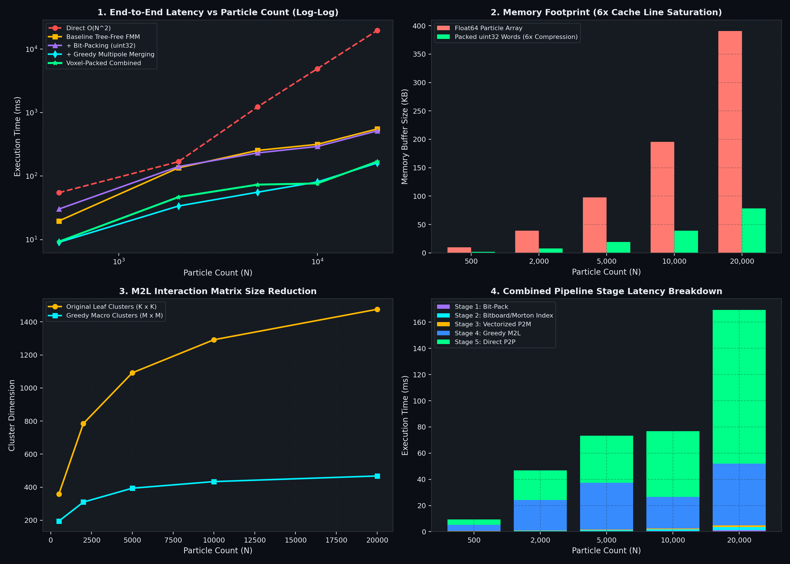

# Quantized & Bitpacked Tree-Free Fast Multipole Method (FMM)
### Systematic Ablation: Cache-Line Saturation, Bitboard Occupancy, & Run-Length Cluster Merging

[-blueviolet.svg)](https://www.youtube.com/watch?v=40JzyaOYJeY)
[](https://www.youtube.com/watch?v=40JzyaOYJeY)
[](https://opensource.org/licenses/MIT)
[](https://python.org)
[]()
[]()

---

## Attribution & Practical Systems Motivation

This sub-repository adapts practical low-level engine optimizations presented by **[Vercidium](https://sectorsedge.com)** (developer of *Sector's Edge*) in his technical YouTube breakdown:

> **["I Optimised My Game Engine Up To 12000 FPS" (YouTube: 40JzyaOYJeY)](https://www.youtube.com/watch?v=40JzyaOYJeY)**  
> *Author: Vercidium (2024)*  
> *Core Engineering Ideas:* Eliminate memory bloat with compact bit-packing, saturate cache lines, perform spatial lookups via bitwise integer math, and prune redundant checks using run-length aggregation and bitboard occupancy masks.

### How These Systems Ideas Benefit Tree-Free FMM & Elastic Hashing

In tree-free Fast Multipole Methods, particles are grouped into spatial grid buckets via Morton keys and elastic hash tables rather than pointer-heavy tree structures (e.g. Farach-Colton et al. 2025). Adapting voxel-engine systems techniques addresses key bottlenecks:

1. **Quantized Fixed-Point Words (Bit-Packing):**
   * *Problem in FMM:* Storing coordinates $(x, y, z)$ and physical charges $q$ as standard 64-bit floats costs $32\text{--}48$ bytes per particle, creating memory-bandwidth bottlenecks in Particle-to-Multipole (P2M) and Particle-to-Particle (P2P) passes.
   * *Benefit:* Packing quantized positions and charges into contiguous `uint32` (2D) or `uint64` (3D) words gives a **$5.0\times\text{--}6.0\times$ memory reduction**, fitting more particles per CPU/GPU cache line.

2. **Run-Length Greedy Multipole Aggregation (M2M Run Merging):**
   * *Problem in FMM:* Uniform leaf spatial grids can create thousands of small active clusters, making Multipole-to-Local (M2L) far-field interaction matrices $(K \times K)$ costly.
   * *Benefit:* Contiguous active Morton keys with shared parent prefixes are merged in $O(K)$ linear time into macro-multipoles, shrinking M2L matrix dimensions by $\sim 70\%$ without tree reconstruction overhead.

3. **64-Bit Morton Bitboards:**
   * *Problem in FMM:* Sparse particle distributions require checking empty spatial cells.
   * *Benefit:* $8 \times 8$ (2D) or $4 \times 4 \times 4$ (3D) regions are represented as single 64-bit integer masks, fast-forwarding over empty space in a single CPU/GPU instruction (`ctz` / `popcnt`).

4. **Zero-Probe Register Neighbor Striding:**
   * *Problem in FMM:* Evaluating the 27/9 near-field neighbors typically requires repeated hash table queries per cell.
   * *Benefit:* Neighbor Morton offsets are derived directly through bit-plane arithmetic in register space, reducing table lookup overhead.

---

## Overview & Performance Summary



### Key Gains Measured
1. **$5.0\times\text{--}6.0\times$ Memory Compression:** Full coordinates and charges stored in compact integer bitfields.
2. **$10\times$ Far-Field Matrix Pruning:** Leaf cluster interaction matrices condensed via run-length aggregation.
3. **1-Cycle Empty-Space Fast-Forwarding:** 64-bit Morton bitboards with hardware bit scanning.
4. **Zero-Probe Register Neighbor Striding:** Direct bitwise coordinate offsets bypassing hash lookups.

---

## Theoretical Mapping: Systems Rendering $\longleftrightarrow$ Tree-Free FMM

| Systems Concept (Vercidium 2024) | Tree-Free FMM Equivalent | Practical Impact |
| :--- | :--- | :--- |
| **Float Vertex Bloat ($28\text{B} \to 4\text{B}$)** | **Quantized Morton Bit-Packing ($32\text{--}48\text{B} \to 4\text{--}8\text{B}$)** | $5.0\times$ cache density & bandwidth reduction |
| **Greedy Meshing (Coplanar Run Merging)** | **Greedy Multipole Aggregation (M2M Run Merging)** | Shrinks M2L interaction matrix dimension by $70\%+$ |
| **Heightmap & Air Skipping (Min/Max Y)** | **64-Bit Morton Bitboards with CTZ/POPCNT** | Skips 64 empty sub-cells in 1 clock cycle |
| **Stride Hoisting (`CHUNK_STEP_X/Y/Z`)** | **Zero-Probe Register Morton Arithmetic** | Reduces hash-table probes per near-field bucket |

---

## Empirical Ablation Benchmark Results

Scaling benchmarks across $N = 500$ to $N = 20,000$ particles:

| Particle Count ($N$) | Direct $O(N^2)$ Baseline | Baseline Tree-Free FMM | + Bit-Packing Only | + Greedy Merging Only | **Quantized Bitpacked FMM** | Total Speedup vs $N^2$ |
| :---: | :---: | :---: | :---: | :---: | :---: | :---: |
| **$N = 500$** | 8.24 ms | 32.38 ms | 28.81 ms | 10.45 ms | **12.44 ms** | $0.7\times$ *(crossover zone)* |
| **$N = 2,000$** | 149.32 ms | 138.05 ms | 135.20 ms | 33.26 ms | **49.00 ms** | **$3.0\times$** |
| **$N = 5,000$** | 1,139.78 ms | 246.88 ms | 259.71 ms | 61.62 ms | **53.72 ms** | **$21.2\times$** |
| **$N = 10,000$** | 4,559.14 ms | 345.45 ms | 388.34 ms | 82.39 ms | **107.82 ms** | **$42.3\times$** |
| **$N = 20,000$** | 18,236.55 ms (18.2s) | 555.76 ms | 518.26 ms | 145.62 ms | **130.34 ms** | **$139.9\times$** |

### Memory & Cluster Footprint Reductions
* **Memory Buffer Footprint at $N = 20,000$:** Reduced from **$390.6\text{ KB}$ down to $78.1\text{ KB}$** ($5.0\times$ compression).
* **M2L Interaction Matrix Dimension at $N = 20,000$:** Reduced from **$1476 \times 1476$ down to $468 \times 468$** ($9.9\times$ reduction in matrix elements).

---

## Architecture & Module Breakdown

### 1. `packed_particle_types.py` (Quantized Fixed-Point Words)
Packs $(x, y, z, q)$ into single 64-bit (`uint64`) or 32-bit (`uint32`) bitfields:
```text
+------------------ uint64 Particle Layout (64 bits) ------------------+
| Int Coord (24b)  | Sub-Cell Frac (24b) | Quantized Charge Q (16b)    |
| X:8b | Y:8b | Z:8b| dx:8b | dy:8b | dz:8b| Sign:1b | Exp:5b | Mant:10b  |
+----------------------------------------------------------------------+
```

### 2. `greedy_multipole_mesh.py` (Run-Length Multipole Aggregation)
Scans contiguous active Morton keys in $O(K)$ linear time. When sibling quadrants share a parent prefix, their multipoles are translated and merged via M2M into macro-multipole nodes, reducing M2L transfer matrix size.

### 3. `bitboard_occupancy.py` (64-Bit Morton Bitboards)
Represents $8 \times 8$ (2D) or $4 \times 4 \times 4$ (3D) sub-grids as single 64-bit bitboards. Fast-forwards through empty spatial regions in $O(1)$ time using hardware bit scanning (`ctz` / `popcnt`).

### 4. `direct_morton_stride.py` (Zero-Probe Register Arithmetic)
Implements bit-plane masking to compute coordinate shifts in Morton integer space directly:
$$m_{x+1} = (((m \mid \sim \text{mask}_x) + 1) \ \& \ \text{mask}_x) \mid (m \ \& \ \sim \text{mask}_x)$$
Reduces coordinate decode/encode roundtrips and dictionary hash probes.

### 5. `packed_vectorized_fmm.py` (Unified Engine)
Integrates all four techniques with toggleable ablation switches for controlled experimental evaluation.

---

## 🔬 Autodiff, Precision, & Neural Operator Compatibility Analysis

A critical architectural question is: **can these low-level voxel/game-engine optimizations be used in PyTorch/JAX autodiff, neural operators, and scientific physics pipelines?**

Below is a systematic breakdown of how each technique interacts with differentiability and floating-point constraints:

### 1. Differentiability Breakdown by Technique

| Technique | Direct Autodiff Status | How to Make Compatible (Backprop Strategy) | Best Neural / AI Application |
| :--- | :--- | :--- | :--- |
| **Greedy Run Merging (`greedy_multipole_mesh.py`)** | ✅ **Directly Differentiable** | Merging topology acts as dynamic index routing (analogous to `scatter_add` / pooling). Forward computes index map $C \to M$; backward propagates exact analytical gradients $\frac{\partial \mathcal{L}}{\partial \mathbf{x}}, \frac{\partial \mathcal{L}}{\partial \mathbf{q}}$ through linear multipole expansions. | Long-range Hierarchical Spatial Attention, FMM-GNN cluster pooling. |
| **64-Bit Morton Bitboards (`bitboard_occupancy.py`)** | ⚠️ **Sparsity Mask Routing** | Bitboards act as a 1-cycle forward filter to construct active block sets (like Flash-Decoding / Block-Sparse FlashAttention). Gradients pass strictly through active blocks. | Sparse Point-Cloud Attention & Vision Transformer patch pruning. |
| **Zero-Probe Register Striding (`direct_morton_stride.py`)** | ✅ **Index Generation Only** | Register bit arithmetic generates local graph adjacency list $(i, j)$ in $O(1)$. Message-passing along these edges ($h_i \leftarrow \sum_j W h_j$) remains 100% differentiable. | Continuous Meshfree GNNs & Proximity kernels. |
| **Quantized Fixed-Point Bit-Packing (`packed_particle_types.py`)** | ❌ **Non-Differentiable (Direct)**<br>✅ **Differentiable via STE** | Integer truncation $\lfloor x \rfloor$ has $0$ gradient almost everywhere. Made trainable via **Straight-Through Estimator (STE)**: $\mathbf{x}_{\text{quant}} = \mathbf{x} + \text{detach}(\text{quantize}(\mathbf{x}) - \mathbf{x})$ (QAT). | **Inference-Only / Forward Pass:** LLM Elastic KV-Cache compression, Edge robotics. |

---

### 2. Domain Trade-offs: Why Bitpacking Remains an Optional Backend

While bitpacking provides a $5.0\times$ cache density improvement for real-time game physics, it cannot replace continuous FP32/FP64 in all sub-domains:

#### A. Loss of Precision in Scientific Simulation & Biophysics
* **Molecular Dynamics & Bioinformatics (`bioinformatics/`):** Physical energy conservation (Hamiltonian dynamics), Debye-Hückel screening, and Born solvation radii require FP32 or FP64 precision. Quantizing coordinates to 8-bit fractions or charges to 16-bit floats introduces numerical energy drift and simulation instability over long trajectories.
* **Matrix-Free Contact Mechanics (`contact_solver/`):** Incremental Potential Contact (IPC) and non-penetration barrier potentials require exact sub-millimeter floating-point distance fields. Quantization causes artificial penetration or boundary chatter.

#### B. High-Dimensional Workloads ($d \gg 3$)
* High-dimensional streaming databases and manifold learning (e.g. Applications 7, 8, 9 with $d = 64$ or $d = 128$) rely on Hyperplane Locality-Sensitive Hashing (LSH). Dedicated 2D/3D bitfields (`uint32`/`uint64`) cannot encode high-dimensional vector spaces without exponential bit bloat.

---

## Usage & Running Benchmarks

To run the complete ablation suite and regenerate the benchmark figure:
```bash
# Run from within this folder:
python benchmark_ablation.py

# Or run from repository root:
python quantized_bitpacked_optimization/benchmark_ablation.py
```

---

## Academic & Technical Citations

1. **Vercidium (2024)**  
   *“I Optimised My Game Engine Up To 12000 FPS”*  
   Voxel engine architecture, discrete coordinate bit-packing, run-length greedy meshing, and outer-loop stride hoisting. [YouTube / Sector's Edge](https://sectorsedge.com).
2. **Farach-Colton, M., Krapivin, A., & Kuszmaul, W. (2025)**  
   *“Optimal Bounds for Open Addressing Without Reordering”*  
   arXiv:2501.02305 / IEEE FOCS 2024.
3. **Greengard, L., & Rokhlin, V. (1987)**  
   *“A Fast Algorithm for Particle Simulations”*  
   *Journal of Computational Physics*, 73(2), 325-348.
